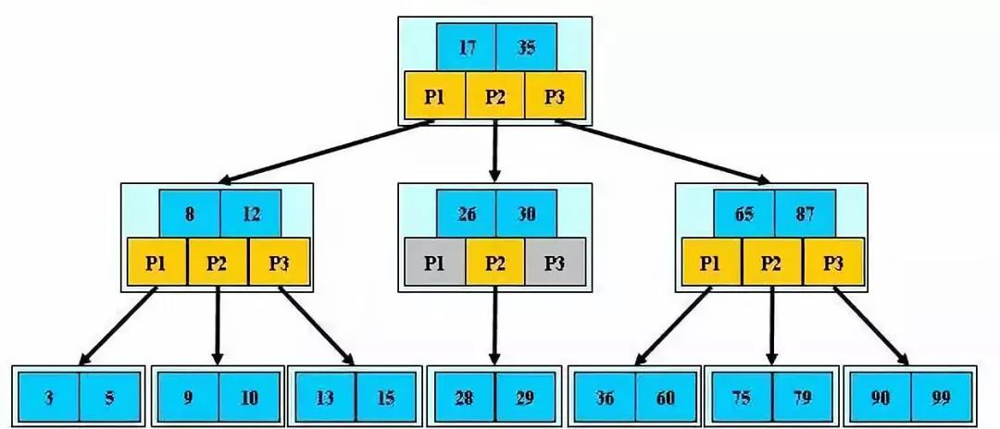

# MySQL索引

注：上面提到的B树索引并没有指出是B-Tree和B+Tree索引，但是B-树和B+树的定义是有区别的。

在 MySQL 中，主要有四种类型的索引，分别为：B-Tree 索引， Hash 索引， Fulltext 索引和 R-Tree 索引。

B-Tree（Balance Tree） 索引是 MySQL 数据库中使用最为频繁的索引类型，除了 Archive 存储引擎之外的其他所有的存储引擎都支持 B-Tree 索引。Archive 引擎直到 MySQL 5.1 才支持索引，而且只支持索引单个 AUTO_INCREMENT 列

一般来说， MySQL 中的 B-Tree 索引的物理文件大多都是以 Balance Tree 的结构来存储的，也就是所有实际需要的数据都存放于 Tree 的 Leaf Node(叶子节点) ，而且到任何一个 Leaf Node 的最短路径的长度都是完全相同的，所以我们大家都称之为 B-Tree 索引。

## B树（二叉搜索树）

1、所有非叶子结点至多拥有两个儿子（Left和Right）；
2、所有结点存储一个关键字；
3、非叶子结点的左指针指向小于其关键字的子树，右指针指向大于其关键字的子树；

## B-树(多路搜索树)

1、定义任意非叶子结点最多只有M个儿子；且M>2；
2、根结点的儿子数为[2, M]；
3、除根结点以外的非叶子结点的儿子数为[M/2, M]；
4、每个结点存放至少M/2-1（取上整）和至多M-1个关键字；（至少2个关键字）
5、非叶子结点的关键字个数=指向儿子的指针个数-1；
6、非叶子结点的关键字：K[1], K[2], …, K[M-1]；且K[i] < K[i+1]；
7、非叶子结点的指针：P[1], P[2], …, P[M]；其中P[1]指向关键字小于K[1]的子树，P[M]指向关键字大于K[M-1]的子树，其它P[i]指向关键字属于(K[i-1], K[i])的子树；
8、所有叶子结点位于同一层；

如：（M=3）

B-树的特性：
1、关键字集合分布在整颗树中；
2、任何一个关键字出现且只出现在一个结点中；
3、搜索有可能在非叶子结点结束；
4、其搜索性能等价于在关键字全集内做一次二分查找；
5、自动层次控制；

由于限制了除根结点以外的非叶子结点，至少含有M/2个儿子，确保了结点的至少利用率。所以B-树的性能总是等价于二分查找（与M值无关），也就没有B树平衡的问题；

## B+树
B+树是B-树的变体，也是一种多路搜索树：
1、其定义基本与B-树同，除了：
2、非叶子结点的子树指针与关键字个数相同；
3、非叶子结点的子树指针P[i]，指向关键字值属于[K[i], K[i+1])的子树（B-树是开区间）；
5、为所有叶子结点增加一个链指针；
6、所有关键字都在叶子结点出现；

如：（M=3）

B+的特性：
1、所有关键字都出现在叶子结点的链表中（稠密索引），且链表中的关键字恰好是有序的；
2、不可能在非叶子结点命中；
3、非叶子结点相当于是叶子结点的索引（稀疏索引），叶子结点相当于是存储（关键字）数据的数据层；
4、更适合文件索引系统；

### b+树性质
1. IO次数取决于b+数的高度h，假设当前数据表的数据为N，每个磁盘块的数据项的数量是m，则有h=㏒(m+1)N，当数据量N一定的情况下，m越大，h越小；而m = 磁盘块的大小 / 数据项的大小，磁盘块的大小也就是一个数据页的大小，是固定的，如果数据项占的空间越小，数据项的数量越多，树的高度越低。这就是为什么每个数据项，即索引字段要尽量的小，比如int占4字节，要比bigint8字节少一半。这也是为什么b+树要求把真实的数据放到叶子节点而不是内层节点，一旦放到内层节点，磁盘块的数据项会大幅度下降，导致树增高。当数据项等于1时将会退化成线性表。
2. 当b+树的数据项是复合的数据结构，比如(name,age,sex)的时候，b+数是按照从左到右的顺序来建立搜索树的，比如当(张三,20,F)这样的数据来检索的时候，b+树会优先比较name来确定下一步的所搜方向，如果name相同再依次比较age和sex，最后得到检索的数据；但当(20,F)这样的没有name的数据来的时候，b+树就不知道下一步该查哪个节点，因为建立搜索树的时候name就是第一个比较因子，必须要先根据name来搜索才能知道下一步去哪里查询。比如当(张三,F)这样的数据来检索时，b+树可以用name来指定搜索方向，但下一个字段age的缺失，所以只能把名字等于张三的数据都找到，然后再匹配性别是F的数据了， 这个是非常重要的性质，即索引的最左匹配特性。
3. B+树还有一个最大的好处，方便扫库，B树必须用中序遍历的方法按序扫库，而B+树直接从叶子结点挨个扫一遍就完了，B+树支持range-query非常方便，而B树不支持。这是数据库选用B+树的最主要原因。 

### B+树的分裂

插入记录6，7，B+树结构会产生以下的一系列变化：
插入记录6，新的B+树结构如下：
插入记录7，由于叶页面中只能存放4条记录，插入记录7，导致叶页面分裂，产生一个新的叶页面。

- 按照原页面中50%的数据量进行分裂，针对当前这个分裂操作，3，4记录保留在原有页面，5，6记录，移动到新的页面。最后将新纪录7插入到新的页面中；
- 分裂之后，两个页面的空间利用率是一样的；如果新的插入是随机在两个页面中挑选进行，那么下一次分裂的操作就会更晚触发；
- 空间利用率不高：按照传统50%的页面分裂策略，索引页面的空间利用率在50%左右；
- 分裂频率较大：针对如上所示的递增插入(递减插入)，每新插入两条记录，就会导致最右的叶页面再次发生分裂；

### Inodb的优化
经过优化，以上的B+树索引，在记录6插入完毕，记录7插入引起分裂之后，新的B+树结构如下图所示：

- 索引分裂的代价小：不需要移动记录；
- 引分裂的概率降低：如果接下来的插入，仍旧是递增插入，那么需要插入4条记录，才能再次引起页面的分裂。相对于50%分裂策略，分裂的概率降低了一半；
- 索引页面的空间利用率提高：新的分裂策略，能够保证分裂前的页面，仍旧保持100%的利用率，提高了索引的空间利用率；
- 如果新的插入，是随机插入，而是插入到原有页面，那么就会导致原有页面再次分裂，增加了分裂的概率。

优化带来的问题：http://hedengcheng.com/?p=525

## 聚簇索引与二级索引(非聚簇索引)
 每个InnoDB的表都拥有一个特殊索引，此索引中存储着行记录（称之为聚簇索引Clustered Index），一般来说，聚簇索引是根据主键生成的。聚簇索引按照如下规则创建：
- 当定义了主键后，InnoDB会利用主键来生成其聚簇索引；
- 如果没有主键，InnoDB会选择一个非空的唯一索引来创建聚簇索引；
- 如果这也没有，InnoDB会隐式的创建一个自增的列(rowid)来作为聚簇索引。

除了主键索引之外的索引，称为二级索引（Secondary Index）。二级索引可以有多个，二级索引建立在经常查询的列上。与聚簇索引的区别在于二级索引的叶子节点中存放的是除了这几个列外用来回表的主键信息（指针）
回表：就是在使用二级索引时，因为二级索引只存储了部分数据，如果根据键值查找的数据不能包含全部目标数据，就需要根据二级索引的键值的主键信息，去聚簇索引的全部数据。然后根据完整数据取出所需要的列。这种在二级索引不能找到全部列的现象称为“非索引覆盖”，需要两次B+树查询，反之称为索引覆盖。所以索引需要平衡考虑，多建索引有利于查询，但是占用空间大还影响写入性能。即索引要精有用。

### 优点
1. 由于行数据和叶子节点存储在一起，这样主键和行数据是一起被载入内存的，找到叶子节点就可以立刻将行数据返回了，如果按照主键Id来组织数据，获得数据更快。
2. 辅助索引使用主键作为"指针" 而不是使用地址值作为指针的好处是，减少了当出现行移动或者数据页分裂时辅助索引的维护工作，使用主键值当作指针会让辅助索引占用更多的空间，换来的好处是InnoDB在移动行时无须更新辅助索引中的这个"指针"。也就是说行的位置（实现中通过16K的Page来定位）会随着数据库里数据的修改而发生变化（前面的B+树节点分裂以及Page的分裂），使用聚簇索引就可以保证不管这个主键B+树的节点如何变化，辅助索引树都不受影响。

MyISAM引擎使用B+Tree作为索引结构，叶节点的data域存放的是数据记录的地址。

### 样例
以自定义主键为例，介绍二级索引与聚簇索引的逻辑关系：

#### 聚簇索引
- 索引结构：[主键列] \[TRXID\] [ROLLPTR] \[其他建表的非主键列\]
- 参与记录比较的列：主键列
- 内节点key列：[主键列]+page No指针

#### 二级唯一索引
- 索引结构：[唯一索引列]\[主键列\]
- 参与记录比较的列：[唯一索引列]\[主键列\]
- 内节点key列：[唯一索引列]+page No指针

#### 二级非唯一索引
- 索引结构：[非唯一索引列]\[主键列\]
- 参与记录比较的列：[非唯一索引列]\[主键列\]
- 内节点key列：[非唯一索引列]\[主键列\]+page No指针
- 未自定义主键列的，主键列有rowid替代。

## 建索引的几大原则

1、最左前缀匹配原则，非常重要的原则，mysql会一直向右匹配直到遇到范围查询(>、<、between、like)就停止匹配，比如a = 1 and b = 2 and c > 3 and d = 4 如果建立(a,b,c,d)顺序的索引，d是用不到索引的，如果建立(a,b,d,c)的索引则都可以用到，a,b,d的顺序可以任意调整。

2、=和in可以乱序，比如a = 1 and b = 2 and c = 3 建立(a,b,c)索引可以任意顺序，mysql的查询优化器会帮你优化成索引可以识别的形式

3、尽量选择区分度高的列作为索引,区分度的公式是count(distinct col)/count(\*)，表示字段不重复的比例，比例越大我们扫描的记录数越少，唯一键的区分度是1，而一些状态、性别字段可能在大数据面前区分度就是0，那可能有人会问，这个比例有什么经验值吗？使用场景不同，这个值也很难确定，一般需要join的字段我们都要求是0.1以上，即平均1条扫描10条记录

4、索引列不能参与计算，保持列“干净”，比如from_unixtime(create_time) = ’2014-05-29’就不能使用到索引，原因很简单，b+树中存的都是数据表中的字段值，但进行检索时，需要把所有元素都应用函数才能比较，显然成本太大。所以语句应该写成create_time = unix_timestamp(’2014-05-29’);

5、尽量的扩展索引，不要新建索引。比如表中已经有a的索引，现在要加(a,b)的索引，那么只需要修改原来的索引即可。

## 引用
https://mp.weixin.qq.com/s/qvm5GEgLNv5dnbcVA-d5Ag
https://blog.csdn.net/bohu83/article/details/81104432