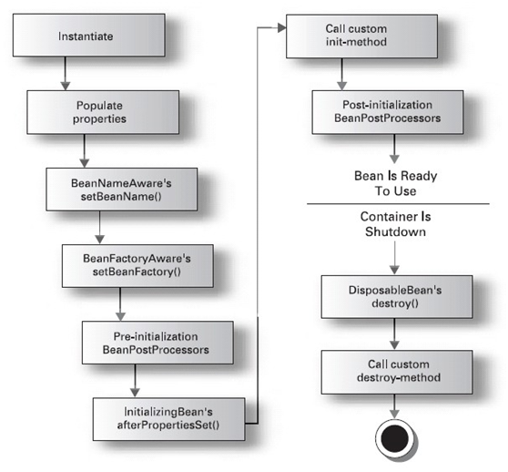

# Spring

## bean生命周期
1）设置属性值；
2）调用Bean中的BeanNameAware.setBeanName()方法，如果该Bean实现了BeanNameAware接口；
3）调用Bean中的BeanFactoryAware.setBeanFactory()方法，如果该Bean实现了BeanFactoryAware接口；
4）调用BeanPostProcessors.postProcessBeforeInitialization()方法；
5）调用Bean中的afterPropertiesSet方法，如果该Bean实现了InitializingBean接口；
6）调用Bean中的init-method，通常是在配置bean的时候指定了init-method，例如：<bean class="beanClass" init-method="init"></bean>
7）调用BeanPostProcessors.postProcessAfterInitialization()方法；
8）如果该Bean是单例的，则当容器销毁并且该Bean实现了DisposableBean接口的时候，调用destory方法；如果该Bean是prototype，则将准备好的Bean提交给调用者，后续不再管理该Bean的生命周期。

## bean加载过程

1. 转化对应的beanName

这里传入的参数name不一定就是beanName，有可能是别名或FactoryBean，所以需要进行一系列的解析，这些解析内容包括如下内容

去除FactoryBean的修饰符，也就是如果name=”&aa”，那么会首先去除&而使name=”aa”

取指定alias所表示的最终beanName，例如别名A指向名称为B的bean则返回B；若别名A指向别名B，别名B又指向名称为C的bean则返回C

2. 尝试从缓存中加载单例

单例在Spring的同一个容器内只会被创建一次，后续再获取bean，就直接从单例缓存中获取了。这里只是尝试加载，首先尝试从缓存中加载，如果加载不成功则再次尝试从singletonFactories中加载，因为在创建单例bean的时候会存在依赖注入的情况，而在创建依赖的时候为了避免循环依赖，在Spring中创建bean的原则是不等bean创建完成就会将创建bean的ObjectFactory提早曝光加入到缓存中，一旦下一个bean创建时候需要依赖上一个bean则直接使用ObjectFactory

3. bean实例化

如果从缓存中得到了bean的原始状态，则需要对bean进行实例化，这里有必要强调一下，在缓存中记录的只是最原始的bean状态，并不一定是我们最终想要的bean

4. 原型模式的依赖检查

只有在单例情况下才会尝试解决循环依赖，如果存在A中有B的属性，B中有A的属性，那么当依赖注入的时候，就会产生当A还未创建完的时候因为对于B的创建再次返回创建A，造成循环依赖，也就是情况：isPrototypeCurrentlyInCreation(beanName)判断true

5. 检测parentBeanFactory

从代码上来看，如果缓存没有数据的话直接转到父类工厂上去加载，!this.containsBeanDefinition(beanName检测如果当前加载的XML配置文件中不包含beanName所对应的配置，就只能到parentBeanFactory去尝试，然后再去递归的调用getBean方法

6. 将存储XML配置文件的GernericBeanDefinition转换为RootBeanDefinition

因为从XML配置文件中读取到的Bean信息是存储在GernericBeanDefinition中的，但是所有的Bean后续处理都是针对于RootBeanDefinition的，所以这里需要进行一个转换，转换的同时如果父类bean不为空的话，则会一并合并父类属性

7. 寻找依赖

因为bean的初始化过程很可能会用到某些属性，而某些属性很可能是动态配置的，并且配置成依赖于其他的bean，那么这个时候就有必要先加载依赖的bean，所以，在Spring的加载顺序中，在初始化某一个bean的时候首先会初始化这个bean所对应的依赖

8. 针对不同的scope进行bean的创建

在Spring中存在着不同的scope，其中默认的是singleton，但是还有些其他的配置诸如prototype、request之类的，在这个步骤中，Spring会根据不同的配置进行不同的初始化策略

9. 类型转换

程序到这里返回bean后已经基本结束了，通常对该方法的调用参数requiredType是为空的，但是可能会存在这样的情况，返回的bean其实是个String，但是requiredType却传入Integer类型，那么这时候本步骤就会起作用了，它的功能是将返回的bean转换为requiredType所指定的类型，当然，String转换为Integer是最简单的一种转换，在Spring中提供了各种各样的转换器，用户也可以自己扩展转换器来满足需求

## MVC

请求开始---> dispatchServlet ---> handlerMapping-->返回一个handler-->提交给handlerAdapter执行-->执行完返回ModelAndView-->给ViewResolver解析-->产生view

SpringMVC流程
1. Tomcat 启动，对 DispatcherServlet 进行实例化，然后调用它的 init() 方法进行初始化，在这个初始化过程中完成了：
对 web.xml 中初始化参数的加载；建立 WebApplicationContext (SpringMVC的IOC容器)；进行组件的初始化；
2. 客户端发出请求，由 Tomcat 接收到这个请求，如果匹配 DispatcherServlet 在 web.xml 中配置的映射路径，Tomcat 就将请求转交给 DispatcherServlet 处理；
3. DispatcherServlet 从容器中取出所有 HandlerMapping 实例（每个实例对应一个 HandlerMapping 接口的实现类）并遍历，每个 HandlerMapping 会根据请求信息，通过自己实现类中的方式去找到处理该请求的 Handler (执行程序，如Controller中的方法)，并且将这个 Handler 与一堆 HandlerInterceptor (拦截器) 封装成一个 HandlerExecutionChain 对象，一旦有一个 HandlerMapping 可以找到 Handler 则退出循环；（详情可以看 [Java]SpringMVC工作原理之二：HandlerMapping和HandlerAdpater 这篇文章）
4. DispatcherServlet 取出 HandlerAdapter 组件，根据已经找到的 Handler，再从所有 HandlerAdapter 中找到可以处理该 Handler 的 HandlerAdapter 对象；
5. 执行 HandlerExecutionChain 中所有拦截器的 preHandler() 方法，然后再利用 HandlerAdapter 执行 Handler ，执行完成得到 ModelAndView，再依次调用拦截器的 postHandler() 方法；
6. 利用 ViewResolver 将 ModelAndView 或是 Exception（可解析成 ModelAndView）解析成 View，然后 View 会调用 render() 方法再根据 ModelAndView 中的数据渲染出页面；
7. 最后再依次调用拦截器的 afterCompletion() 方法，这一次请求就结束了。