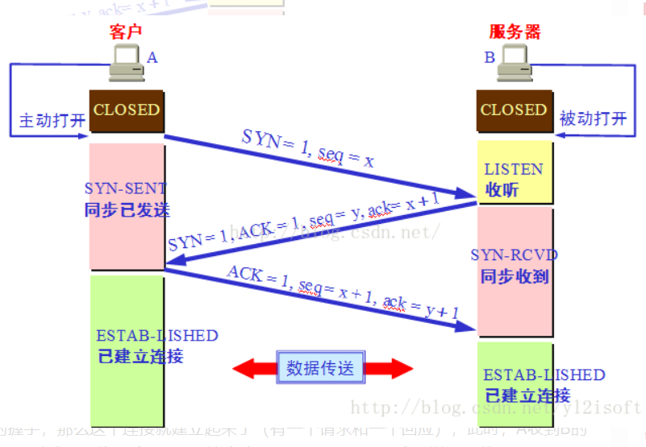
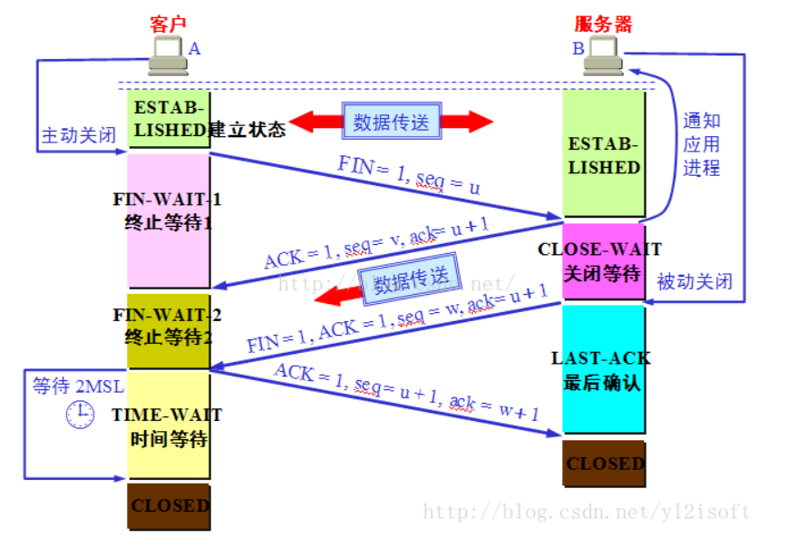
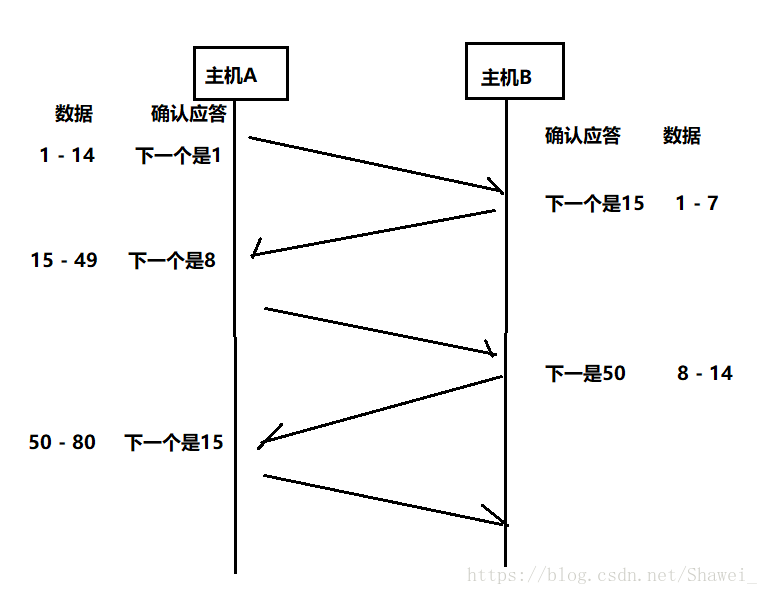
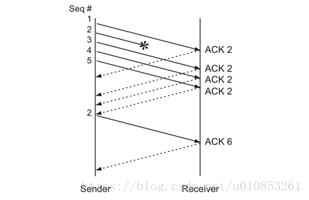
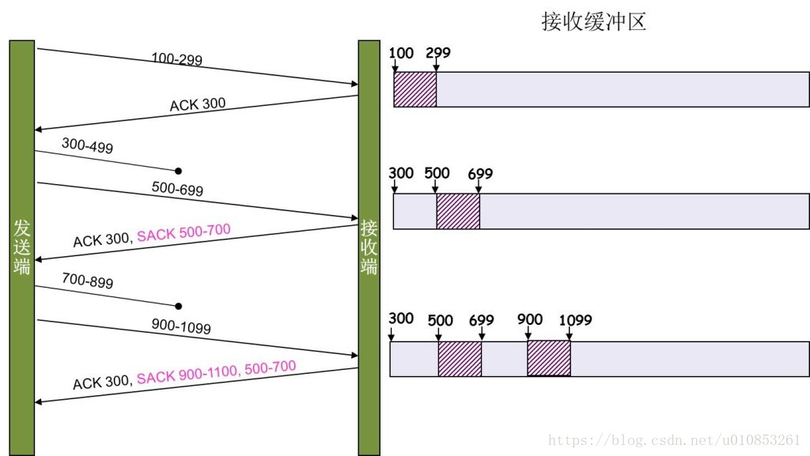

# TCP/IP

## TCP
为了保证TCP的可靠传输，TCP分别提出了8中机制： 
1.确认应答机制 
2.超时重传机制 
3.滑动窗口机制 
4.快速重传机制 
5.流量控制机制 
6.拥塞控制机制 
7.延时应答机制 
8.捎带应答机制

### 三次握手（(three times handshake;three-way handshake）
- 第一次握手：建立连接时，客户端发送syn包(syn=j)到服务器，并进入SYN_SENT状态，等待服务器确认。SYN：同步序列编号（Synchronize Sequence Numbers）。
- 第二次握手：服务器收到syn包，必须确认客户的SYN(ack=j+1)，同时自己也发送一个SYN包(seq=k),即SYN+ACK包，此时服务器进入SYN_RECV状态；
- 第三次握手：客户端收到服务器的SYN+ACK包，向服务器发送确认包ACK(ack=k+1),此包发送完毕，客户端和服务器进入ESTABLISHED（TCP连接成功）状态，完成三次握手。



未连接队列
在三次握手协议中，服务器维护一个未连接队列，该队列为每个客户端的SYN包（syn=j）开设一个条目，该条目表明服务器已收到SYN包，并向客户发出确认，正在等待客户的确认包。这些条目所标识的连接在服务器处于 Syn_RECV状态，当服务器收到客户的确认包时，删除该条目，服务器进入ESTABLISHED状态。

Backlog参数
表示内核为相应套接字排队的最大连接个数。SYN-ACK重传次数服务器发送完SYN－ACK包，如果未收到客户确认包，服务器进行首次重传，等待一段时间仍未收到客户确认包，进行第二次重传，如果重传次数超过系统规定的最大重传次数，系统将该连接信息从半连接队列中删除。注意，每次重传等待的时间不一定相同

半连接存活时间
是指半连接队列的条目存活的最长时间，也即服务器从收到SYN包到确认这个报文无效的最长时间，该时间值是所有重传请求包的最长等待时间总和。有时我们也称半连接存活时间为Timeout时间、SYN_RECV存活时间。

### 四次挥手

- 第一次挥手：客户端A发送一个FIN，用来关闭客户到服务器的数据传送，然后等待服务器的确认。其中终止标志位FIN=1，序列号seq=u。 
- 第二次挥手：服务器收到这个FIN，它发回一个ACK，确认号ack为收到的序号加1。 
- 第三次挥手：关闭服务器到客户端的连接：也是发送一个FIN给客户端。 
- 第四次挥手：客户段收到FIN后，并发回一个ACK报文确认，并将确认序号seq设置为收到序号加1。 首先进行关闭的一方将执行主动关闭，而另一方执行被动关闭。发送ACK后，状态由原来的FIN_WAIT_2置为TIME_WAIT，客户在经过2MSL 时间进入CLOSE状态



MSL就是maximum segment lifetime(最大分节生命期），这是一个IP数据包能在互联网上生存的最长时间，超过这个时间IP数据包将在网络中消失 。MSL在RFC 1122上建议是2分钟，而源自berkeley的TCP实现传统上使用30秒

TIME_WAIT状态维持时间
TIME_WAIT状态维持时间是两个MSL时间长度，也就是在1-4分钟。Windows操作系统就是4分钟。
A不能保证最后的ACK能达到B， 所以， 还应该观望一段时间， 护送一段时间。 如果最后的ACK丢失， 那么B显然收不到,  B于是发起了重传FIN的操作， 此时如果A处于CLOSED的状态， 就没办法给对端发ACK了（实际是发RST）， 呜呼哀哉。 所以A应该等一段时间， 这段时间就是所谓的TIME_WAIT， 比如， 等待一个RTT的时间（实际上， 考虑到如下的理由之二就知道， RTT可能不够， 用2MSL更靠谱）。

       所以， TIME_WAIT存在的理由之一是尽可能护送最后的ACK达到对端。

假设tcp连接是： A(1.2.3.4:8888)------B(6.7.8.9:9999), 这就是一个tcp四元组。 当tcp连接关闭后， 四元组释放。 后面的新连接可能会重用到这个四元组（有这个可能性）， 那么问题就来了： 新四元组和旧四元组完全一致， 他们的网络包会混乱吗？   所以， 可以考虑这样一个机制： 让旧四元组对应的所有网络包都消失后（等一段时间）， 才允许新四元组建立， 颇有点锁的味道。 那么这个等一段时间究竟是多久呢？ 多久才合适呢？ 在前面的文章中， 我们讨论过， 采用2MSL比较合适， 我个人认为， 把TIME_WAIT定义为2MSL只是一个通用的经验方法而已， 无法从理论上百分之百论证。

        所以， TIME_WAIT存在的理由之二是新旧四元组互不干扰。


## 捎带应答
在延时应答的基础上，我们发现，接受方和发送方都是“一发一收”，所以，我们在发送数据的时候，我们把ACK搭顺风车的方式发送给对方了。 



可以使TCP的四次挥手变成三次挥手，即ACK+FIN一起发送

## 延时应答
我们知道TCP中，有确认应答机制以保证数据的可靠传输。但是是不是接受方接受到数据就立即返回ACK应答呢？如果是这样，这时候的缓冲区中接收区的数据还没能够处理，缓存区的剩余大小就是窗口大小。
但是如果我们延迟一会，等待缓存区中数据被处理，那么剩余的缓存区就会大些——这就是延时应答。

## 超时重传
由于下层IP网络层或则路由器可能出现丢失、重复、失序包的情况、TCP要提供可靠数据传输服务必须cover住这些丢包重包异常情况并能够做出正常的处理。
重传尚未确认的数据，TCP有两套独立的机制来完成重传：一是基于时间的，二是基于确认信息的构成。第二种比第一种更加高效。

- 基于时间重传：TCP在发送数据的时候回设置一个计时器，若计时器超时任未收到数据的确认信息，则会引发相应的超时或则计时器的重传操作，计时器超时称为重传超时RTO(Retransmission Timeout)

- 基于确认信息的构成重传称为快速重传：在没有发生延时的情况下，若TCP积累确认无法返回新的ACK或则当ACK包含的选择确认信息SACK表明出现失序报文段时，快速重传会推断出现丢失包

### 基于计时器的重传
TCP发送端得到了基于时间变化的RTT测量值，就能据此设置RTO，发送报文段时应确保重传计时器设置合理。设置计时器前要记录报文序列号，若及时收到了报文的ACK，就取消计时器。TCP的连接发送端不断的设定和取消重传计时器，如果没有数据丢失就不会出现计时器超时。

TCP将超时重传视为相当重要的事件，当发生这种情况时候，通过降低当前数据发送率来对此进行快速响应。实现有两种方法：一是基于拥塞控制机制减小发送窗口，二是当一个报文段被再次重传时候，增大RTO的退避因子。 退避因子正常情况下是1，随着多次重传会加倍成2，4，8等等，直到上限。

大多数情况下计时器超时并触发重传是不必要的，因为RTO的设置一般大于RTT的2倍，因此基于计时器的重传会导致网络利用率下降。

- 设置超时重传RTO
TCP超时和重传的基础是：根据给定连接的数据传输往返延时RTT(Round-Trip Time)来设置RTO。
设置一个合理的RTO对于网络整体利用率至关重要。TCP会在传输过程中采样一些数据传输该确认信息所需要的时间的一些样本。每个此类的测量结果称为RTT样本。TCP首先根据一段时间内的样本值建立好的估计值，第二步是基于估计值设置RTO。RTO设置得当是保证TCP性能的关键。

1. 经典方法：
通过下面的公式计算得到平滑的RTT估计值(SRTT):
```
SRTT <- α(SRTT) + (1-α)RTTs
```
最新的SRTT是根据现存的SRTT和新的样本值RTTs计算出来的。 常量α为平滑因子，推荐值是0.8\~0.9。这种计算方法叫做指数加权移动平均法或则低通过滤器。

```
RTO = min(ubound, max(lbound, (SRTT)β))
```
β是时延离散因子，推荐值1.3\~2.0。 ubound是RTO上边界，lbound是下边界。这种计算方法就是经典方法。
这种方法缺点就是没法适应大规模的变动(网络不稳定情况)

2. 标准方法
具体公式就不给出了，主要说说大致方法论：基于RTT测量值的变化方差、平均值来得到较为精确的估计值RTO。这样更加能适应RTT变化幅度大的情况。

### 快速重传-Fast Retransmit
基于接收端的反馈信息（ACK）来引发重传,而非重传计时器的超时。不以时间驱动，而以数据驱动重传。也就是说，如果，包没有连续到达，就ack最后那个可能被丢了的包，如果发送方连续收到3次相同的ack，就重传。Fast Retransmit的好处是不用等timeout了再重传。



Fast Retransmit只解决了一个问题，就是timeout的问题，它依然面临一个艰难的选择，就是，是重传之前的一个还是重传所有的问题。对于上面的示例来说，是重传#2呢还是重传#2，#3，#4，#5呢？因为发送端并不清楚这连续的3个ack(2)是谁传回来的？也许发送端发了20份数据，是#6，#10，#20传来的呢。这样，发送端很有可能要重传从2到20的这堆数据（这就是某些TCP的实际的实现）。

### SACK 
Selective Acknowledgment (SACK)（参看RFC 2018），这种方式需要在TCP头里加一个SACK的东西，ACK还是Fast Retransmit的ACK，SACK则是汇报收到的数据碎版。参看下图：



这样，在发送端就可以根据回传的SACK来知道哪些数据到了，哪些没有收到。于是就优化了Fast Retransmit的算法。当然，这个协议需要两边都支持。在 Linux下，可以通过tcp_sack参数打开这个功能（Linux 2.4后默认打开）。

这里还需要注意一个问题——接收方Reneging，所谓Reneging的意思就是接收方有权把已经报给发送端SACK里的数据给丢了。这样干是不被鼓励的，因为这个事会把问题复杂化了，但是，接收方这么做可能会有些极端情况，比如要把内存给别的更重要的东西。所以，发送方也不能完全依赖SACK，还是要依赖ACK，并维护Time-Out，如果后续的ACK没有增长，那么还是要把SACK的东西重传，另外，接收端这边永远不能把SACK的包标记为Ack。

注意：SACK会消费发送方的资源，试想，如果一个攻击者给数据发送方发一堆SACK的选项，这会导致发送方开始要重传甚至遍历已经发出的数据，这会消耗很多发送端的资源。详细的东西请参看《TCP SACK的性能权衡》

### Duplicate SACK – 重复收到数据的问题
Duplicate SACK又称D-SACK，其主要使用了SACK来告诉发送方有哪些数据被重复接收了。RFC-2883 里有详细描述和示例。下面举几个例子（来源于RFC-2883）

D-SACK使用了SACK的第一个段来做标志，
如果SACK的第一个段的范围被ACK所覆盖，那么就是D-SACK
如果SACK的第一个段的范围被SACK的第二个段覆盖，那么就是D-SACK

- ACK丢包
下面的示例中，丢了两个ACK，所以，发送端重传了第一个数据包（3000-3499），于是接收端发现重复收到，于是回了一个SACK=3000-3500，因为ACK都到了4000意味着收到了4000之前的所有数据，所以这个SACK就是D-SACK——旨在告诉发送端我收到了重复的数据，而且我们的发送端还知道，数据包没有丢，丢的是ACK包。
```
Transmitted  Received    ACK Sent
Segment      Segment     (Including SACK Blocks)

3000-3499    3000-3499   3500 (ACK dropped)
3500-3999    3500-3999   4000 (ACK dropped)
3000-3499    3000-3499   4000, SACK=3000-3500
```

- 网络延迟
下面的示例中，网络包（1000-1499）被网络给延误了，导致发送方没有收到ACK，而后面到达的三个包触发了“Fast Retransmit算法”，所以重传，但重传时，被延误的包又到了，所以，回了一个SACK=1000-1500，因为ACK已到了3000，所以，这个SACK是D-SACK——标识收到了重复的包。

这个案例下，发送端知道之前因为“Fast Retransmit算法”触发的重传不是因为发出去的包丢了，也不是因为回应的ACK包丢了，而是因为网络延时了。

```
Transmitted    Received    ACK Sent
Segment        Segment     (Including SACK Blocks)

500-999        500-999     1000
1000-1499      (delayed)
1500-1999      1500-1999   1000, SACK=1500-2000
2000-2499      2000-2499   1000, SACK=1500-2500
2500-2999      2500-2999   1000, SACK=1500-3000
1000-1499      1000-1499   3000
               1000-1499   3000, SACK=1000-1500
```

可见，引入了D-SACK，有这么几个好处：

1）可以让发送方知道，是发出去的包丢了，还是回来的ACK包丢了。

2）是不是自己的timeout太小了，导致重传。

3）网络上出现了先发的包后到的情况（又称reordering）

4）网络上是不是把我的数据包给复制了。

知道这些东西可以很好得帮助TCP了解网络情况，从而可以更好的做网络上的流控。

Linux下的tcp_dsack参数用于开启这个功能（Linux 2.4后默认打开）


## 滑动窗口
滑动窗口解决的是流量控制的的问题
TCP会话的双方都各自维护一个发送窗口和一个接收窗口。各自的接收窗口大小取决于应用、系统、硬件的限制（TCP传输速率不能大于应用的数据处理速率）。各自的发送窗口则要求取决于对端通告的接收窗口，要求相同。

发送缓冲区如果太大，就会有空间开销
在TCP的首部中，有一个16为窗口字段，此字段就是用来存放窗口大小信息的
https://blog.csdn.net/yao5hed/article/details/81046945

## 拥塞控制
https://blog.csdn.net/dangzhangjing97/article/details/81008836

## 滑动窗口 VS 拥塞控制
相同点：
- 现象都是丢包
- 实现机制都是让发送方发的慢和少

不同点:
- 丢包位置不同
流量控制在接收端丢包
拥塞控制在路由器丢包
- 作用的对象不同
流量控制的对象是接收方
拥塞控制的对象是网络

拥塞控制通常表示的是一个全局性的过程，它会涉及到网络中所有的主机、所有的路由器和降低网络传输性能的所有因素
流量控制发生在发送端和接收端之间，只是点到点之间的控制

## 标志控制
- URG: 紧急（The urgent pointer) 标志有效。紧急标志置位，
- ACK: 确认编号（Acknowledgement Number）栏有效。大多数情况下该标志位是置位的。TCP报头内的确认编号栏内包含的确认编号（w+1，Figure：1）为下一个预期的序列编号，同时提示远端系统已经成功接收所有数据。
- PSH:该标志置位时，接收端不将该数据进行队列处理，而是尽可能快将数据转由应用处理。在处理 telnet 或 rlogin 等交互模式的连接时，该标志总是置位的。
- RST:复位标志有效。用于复位相应的TCP连接。
- SYN:同步序列编号（Synchronize Sequence Numbers）栏有效。该标志仅在三次握手建立TCP连接时有效。它提示TCP连接的服务端检查序列编号，该序列编号为TCP连接初始端（一般是客户端）的初始序列编号。在这里，可以把TCP序列编号看作是一个范围从0到4，294，967，295的32位计数器。通过TCP连接交换的数据中每一个字节都经过序列编号。在TCP报头中的序列编号栏包括了TCP分段中第一个字节的序列编号。
- FIN:结束标志

## TCP Basic
- ActiveOpens: tcp_connect()，发送SYN时，加１
- PassiveOpens: tcp_create_openreq_child(), 被动三路握手完成，加１
- TW: 等待关闭的TCP连接数。
- inuse：正在使用的TCP套接字数量。
- alloc(allocated)：已分配的TCP套接字数量。


# 引用
https://blog.csdn.net/u010853261/article/details/82109971
