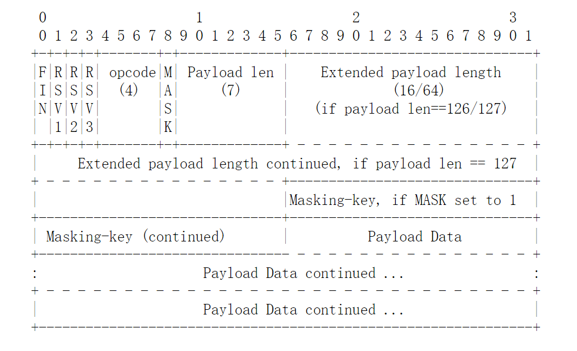
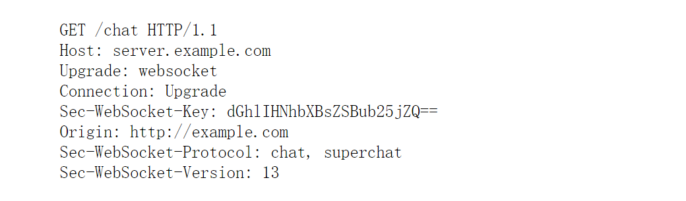
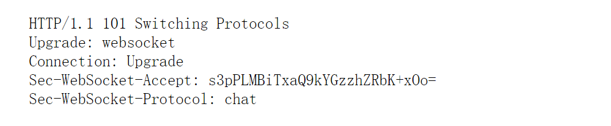

# WebSocket 协议

## WebSocket Protocol Format

websocket报文是分段传输，或者说分帧传输，包含control frames 和 data frames。

- control frames: opcode最高位为1，协议级别的控制报文帧，目前有close fram、 ping frame、 pong frame 三种

close frame: opcode 0x8，连接任一端想关闭连接，就发送一个close frame给对端，对端收到该frame，若之前没有发过close frame，则必须回复一个close frame。发送close frame后该端就不能再发任何的frame，但可以接收数据（不能保证能接收到所有对端在收到close frame之后且在响应close frame之前发的那些data frame）。 close frame可以携带body（即报文中application data部分）以说明要关闭连接的原因。 若有body，则body的前两个字节（unsigned）必须为status code（status code的值都是协议预定义的），接下来两个字节就没有严格的要求了。

ping frame、pong frame：ping frame是用来心跳检测和判断对端是否alive，连接建立后任一端都可以发送ping frame，收到的一端必须回复pong frame（前提是该端未发送close frame）

- data frames：
opcode最高位为0，应用级的数据传输帧，目前有text frame和binary frame两种，text frame使用UTF-8编码。

### 下面为RFC文档给出的协议格式：

- FIN: 1 bit, 代表是否尾帧

- RSV1/RSV2/RSV3: 每个1 bit，保留，若建立连接时使用了扩展（Sec-WebSocket-Extension），那么这些位的含义应该已协商好。

- opcode: 4 bit，定义payload data的类型
0x0：continuation frame
0x1：text frame
0x2: binary frame
0x3-0x7: 保留， for non-control frame
0x8: close frame
0x9: ping frame
0xA: pong frame
0xB-0xF: 保留， for control frame

- MASK: 表示payload data是否被masked

- Payload length: 7 bit or 7 + 16 bit or 7 + 64 bit 若值为
0-125： 则payload data的长度为该值
126： 接下来的2个字节（unsigned）才是payload data的长度
127： 截下来的8个字节（unsigned）才是payload data的长度

- Masking-Key： 0 or 4 bytes， 只有客户端给服务器发的包且这个包的MASK为1，才有该字段

- Payload data: 包含Extension Data & Application Data, 若handshake时使用了Sec-WebSocket-Extension，则Extension Data的长度由Sec-WebSocket-Extension的值指定，或由其推导出，Application Data的长度为Payload length - Extension data length。反之，则Extension Data length为0，Application Data length为Payload length。

### masking

masking和unmasking算法是一样的：maskedData[i] = originData[i]^maskingKey[i mod 4] or orginData[i] = maskedData[i]^maskingKey[i mod 4]

### Extensibility

websocket设计时就考虑了扩展的问题，opcode 0x3-0x7 and 0xB-0xF, frame-rsv1, frame-rsv2, frame-rsv3, extension data. 这些字段都是为扩展保留的。是否使用扩展是在双方连接建立时就需要协商好的

## 连接建立过程

按照RFC标准，WebSocket的的建立需要借助于HTTP，大概是这样：客户端发一个HTTP GET请求(这个请求只包含一些头部，下面有详细说明)到服务端，相当于向服务端说：我想把我们的连接升级为WebSocket，之后你得接收我的WebSocket协议包（当然HTTP也得接收），服务端收到这个HTTP消息后，如果服务端支持WebSocket，那就构造一个HTTP响应（状态码必须为101）返回，若不支持，则返回其他合理状态码的响应，以说明理由。若服务端返回101响应，则服务端就可以发送websocket消息帧了。

### 客户端发起的建立WebSocket连接请求的合法条件

- 请求方式必须为GET，且协议版本号必须大于1.1
- 必须有HOST头，其格式为hostname[:port]
- 必须有Upgrade头，其值必须包含websocket关键字
- 必须有Connection头，其值必须包含Upgrade
- 必须有Sec-WebSocket-Key头，其值为随机生成的16字节的值用BASE64编码后的字符串
- 若客户端为浏览器，则必须有Origin头，其值为请求发起方的hostname (因为中间可能经过代理才到达服务器，服务器可以根据该字段选择是否和客户端建立连接)
- 必须有Sec-WebSocket-Version头，其值必须为13
- 可选头Sec-WebSocket-Protocol，其值为由逗号分隔的子协议的名字，按优先度排序，每个名字必须唯一
- 可选头Sec-WebSocket-Extension，表示协议级别的扩展
- 除以上要求外，可有其它任意符合HTTP的协议头，例如cookies之类的都可以。

### 服务端对客户端发起的建立WebSocket连接请求的响应的合法条件

- 响应状态码必须为101
- 必须有头Upgrade，其值必须为websocket
- 必须有Connection头，其值为必须包含Upgrade
- 必须有Sec-WebSocket-Accept头，其值生成规则：服务端拿到|Sec-WebSocket -Key|，假如其为“dGhlIHNhbXBsZSBub25jZQ==”，服务端就把该串和“58EAFA5-E914-47DA-95CA-C5AB0DC85B11”（这个是固定的）拼起来，变成“dGhlIHNhbXBsZSBub25jZQ==258EAFA5-E914-47DA-95CA-C5AB0DC85B11”，然后取这个串的SHA1摘要，再用BASE64编码，编码后的串即为|Sec-WebSocket-Accept|的值
- 可选头Sec-WebSocket-Protocol，其值为客户端发来的子协议中的一个或空

## 连接关闭过程
关闭过程就很简单，连接任一端想关闭websocket，就发一个close frame（opcode为0x8的就是close frame）给对端，对端收到该frame，若之前没有发过close frame，则必须回复一个close frame。发送或回复close frame后该端就不能再发任何frame，但可以接收数据(但不能保证能接受到所有对端在收到close frame之后且在响应close frame之前发的那些data frame)

文章摘自：https://blog.csdn.net/a1282379904/article/details/52680904