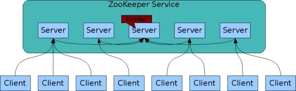
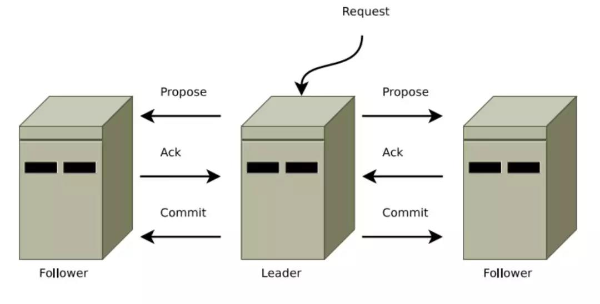

# Zookeeper
分布式协调服务

zkcli -server 192.168.6.21:2181
echo stat|nc 192.168.6.21 2181 查看版本

官方给出了使用zk的几种用途：
- Leader Election
- Barriers
- Queues
- Locks
- Two-phased Commit
- Others(Name Service/Configuration/Group Membership)

## Znode

- data: 存储的数据信息
- ACL: 记录访问权限，
- child: 子节点引用
- stat: 元数据，比如事务ID，版本号，时间戳，大小等

czxid. 节点创建时的zxid.
mzxid. 节点最新一次更新发生时的zxid.
ctime. 节点创建时的时间戳.
mtime. 节点最新一次更新发生时的时间戳.
dataVersion. 节点数据的更新次数.
cversion. 其子节点的更新次数.
aclVersion. 节点ACL(授权信息)的更新次数.
ephemeralOwner. 如果该节点为ephemeral节点, ephemeralOwner值表示与该节点绑定的session id. 如果该节点不是ephemeral节点, ephemeralOwner值为0. 至于什么是ephemeral节点, 请看后面的讲述.
dataLength. 节点数据的字节数.
numChildren. 子节点个数.

## 基本操作

- create
- delete
- exists
- getData
- setData
- getChildren

其中，exists、getData、getChildren属于读操作，ZooKeeper客户端在请求读操作的时候，可以选择是否设置Watch

## Watch
注册在特定Znode上的触发器，当调用create、delete、setData方法的时候，会触发注册的对应事件，请求Watch的客户端会接收到异步通知
具体交互过程如下：

1. 客户端调用 getData 方法，Watch 参数是 true。服务端接到请求，返回节点数据，并且在对应的哈希表里插入被 Watch 的 Znode 路径，以及 Watcher 列表。
2. 当被 Watch 的 Znode 已删除，服务端会查找哈希表，找到该 Znode 对应的所有 Watcher，异步通知客户端，并且删除哈希表中对应的 Key-Value。

## 集群
Zookeeper Service集群是一主多从结构.
更新数据时，首先更新到主节点，再同步到从节点.
读数据时，直接读取从节点.



## 主从数据一致性(ZAB协议--Zookeeper Atomic Broadcast)
Zab协议有两种模式，它们分别是恢复模式（选主）和广播模式（同步）

ZAB三种节点状态：
- Looking: 选举状态
- Following: 从节点所处的状态
- Leading: 主节点所处的状态
- Observing: 观察状态

最大ZXID，几点本地的最新事务编号，包含epoch(纪元)和计数两部分.

恢复模式的三个阶段:
1. Leader election
此时集群中的节点处于Looking状态，他们会各自向其他节点发起投票，投票当中包含自己的服务器ID(sid)和最新事务ID(ZXID),以（sid，zxid）的形式来标识一次投票信息.当接收到其他节点的投票时，优先检查zxid，如果zxid相同，再比较sid，如果比自己大，就重新发起投票，投给目前已知的最大ZXID所属节点。每次投票后，都会统计投票数量，判断是否某个节点得到半数以上投票，如果存在，那个节点就成为准leader，状态变为Leading，其他节点变为Following。
2. Discovery
用于在从节点中发现最新的ZXID和事务日志，leader接受所有的Follower发来的各自最新的epoch值，leader从中选出最大的epoch，并+1，之后分发给各个Follower。各个Follower收到后，返回ACK给leader，并带上各自最大的ZXID和历史事务日志，leader选出最大的ZXID，并更新自身历史日志
3. Synchronization
Leader将刚才收集得到的最新历史事务日志，同步给集群中所有的 Follower。只有当半数 Follower 同步成功，这个准 Leader 才能成为正式的 Leader。

广播模式：
1. 客户端发出写入数据请求给任意Follower。
2. Follower 把写入数据请求转发给 Leader。
3. Leader 采用二阶段提交方式，先发送 Propose 广播给 Follower。
4. Follower 接到 Propose 消息，写入日志成功后，返回 ACK 消息给 Leader。
5. Leader 接到半数以上 ACK 消息，返回成功给客户端，并且广播 Commit 请求给 Follower。



ZAB 协议既不是强一致性，也不是弱一致性，而是处于两者之间的单调一致性。它依靠事务 ID 和版本号，保证了数据的更新和读取是有序的。

## Apache Curator

它由Netflix公司贡献给Apache，相信你在使用ZK API开发时会遇到让人头疼的几个问题，ZK连接管理、SESSION失效等一些异常问题的处理，Curator替我们解决了这些问题，通过对ZK连接状态的监控来做出相应的重连等操作，并触发事件。 更好的地方是Curator对ZK的一些应用场景提供了非常好的实现，而且有很多扩充，这些都符合ZK使用规范。

### 组件

除了ZK 的”Two-phased Commit”的recipe外， Curator提供了全部的ZK的recipe

- Recipes Zookeeper的系列recipe实现，基于Curator Framework
- Framework 封装了大量的zk常用API，降低使用难度，基于zk增加了一些新特性，对zk连接的管理，并自动重连
- Utilities zk操作的工具类，包括zk的集群测试工具路径生成等非常好用，在Curator-Client包下org.apache.curator.utils。
- Client zk客户端API的封装，替代官方的ZooKeeper class，解决一些繁琐低级的处理，提供一些工具类
- Errors 异常处理
- Extensions 对curator-recipes的扩展，可拆分为curator-:stuck_out_tongue_closed_eyes:iscovery和 curator-:stuck_out_tongue_closed_eyes:iscovery-server提供基于RESTful的Recipes WEB服务

### leader选举

Curator 有两种选举recipe， 你可以根据你的需求选择合适的。

#### Leader latch

```java
public LeaderLatch(CuratorFramework client, String latchPath)
public LeaderLatch(CuratorFramework client, String latchPath,  String id)
```

启动LeaderLatch: leaderLatch.start(); 
一旦启动， LeaderLatch会和其它使用相同latch path的其它LeaderLatch交涉，然后随机的选择其中一个作为leader。 你可以随时查看一个给定的实例是否是leader:
```java
public boolean hasLeadership()
```
类似JDK的CountDownLatch， LeaderLatch在请求成为leadership时有block方法
```java
public void await()
          throws InterruptedException,
                 EOFException

public boolean await(long timeout,
                     TimeUnit unit)
             throws InterruptedException
```
一旦不使用LeaderLatch了，必须调用close方法。 如果它是leader,会释放leadership， 其它的参与者将会选举一个leader。
异常处理 LeaderLatch实例可以增加ConnectionStateListener来监听网络连接问题。 当 SUSPENDED 或 LOST 时, leader不再认为自己还是leader.当LOST 连接重连后 RECONNECTED,LeaderLatch会删除先前的ZNode然后重新创建一个. LeaderLatch用户必须考虑导致leadershi丢失的连接问题。 强烈推荐你使用ConnectionStateListener。
```java
package com.colobu.zkrecipe.leaderelection;

import java.io.BufferedReader;
import java.io.IOException;
import java.io.InputStreamReader;
import java.util.List;
import java.util.concurrent.TimeUnit;

import org.apache.curator.framework.CuratorFramework;
import org.apache.curator.framework.CuratorFrameworkFactory;
import org.apache.curator.framework.recipes.leader.LeaderLatch;
import org.apache.curator.retry.ExponentialBackoffRetry;
import org.apache.curator.test.TestingServer;
import org.apache.curator.utils.CloseableUtils;

import com.google.common.collect.Lists;

public class LeaderLatchExample {
    private static final int CLIENT_QTY = 10;
    private static final String PATH = "/examples/leader";

    public static void main(String[] args) throws Exception {

        List<CuratorFramework> clients = Lists.newArrayList();
        List<LeaderLatch> examples = Lists.newArrayList();
        TestingServer server = new TestingServer();
        try {
            for (int i = 0; i < CLIENT_QTY; ++i) {
                CuratorFramework client = CuratorFrameworkFactory.newClient(server.getConnectString(), new ExponentialBackoffRetry(1000, 3));
                clients.add(client);
                LeaderLatch example = new LeaderLatch(client, PATH, "Client #" + i);
                examples.add(example);
                client.start();
                example.start();
            }

            Thread.sleep(20000);

            LeaderLatch currentLeader = null;
            for (int i = 0; i < CLIENT_QTY; ++i) {
                LeaderLatch example = examples.get(i);
                if (example.hasLeadership())
                    currentLeader = example;
            }
            System.out.println("current leader is " + currentLeader.getId());
            System.out.println("release the leader " + currentLeader.getId());
            currentLeader.close();
            examples.get(0).await(2, TimeUnit.SECONDS);
            System.out.println("Client #0 maybe is elected as the leader or not although it want to be");
            System.out.println("the new leader is " + examples.get(0).getLeader().getId());

            System.out.println("Press enter/return to quit\n");
            new BufferedReader(new InputStreamReader(System.in)).readLine();

        } catch (Exception e) {
            e.printStackTrace();
        } finally {
            System.out.println("Shutting down...");
            for (LeaderLatch exampleClient : examples) {
                CloseableUtils.closeQuietly(exampleClient);
            }
            for (CuratorFramework client : clients) {
                CloseableUtils.closeQuietly(client);
            }
            CloseableUtils.closeQuietly(server);
        }
    }
}
```
首先我们创建了10个LeaderLatch，启动后它们中的一个会被选举为leader。 因为选举会花费一些时间，start后并不能马上就得到leader。 通过hasLeadership查看自己是否是leader， 如果是的话返回true。 可以通过.getLeader().getId()可以得到当前的leader的ID。 只能通过close释放当前的领导权。 await是一个阻塞方法， 尝试获取leader地位，但是未必能上位。

#### Leader Election

Curator还提供了另外一种选举方法。 注意涉及以下四个类：

- LeaderSelector
- LeaderSelectorListener
- LeaderSelectorListenerAdapter
- CancelLeadershipException

```java
public LeaderSelector(CuratorFramework client, String mutexPath,LeaderSelectorListener listener)
public LeaderSelector(CuratorFramework client, String mutexPath, ThreadFactory threadFactory, Executor executor, LeaderSelectorListener listener)
```

类似LeaderLatch,必须start: leaderSelector.start(); 一旦启动，当实例取得领导权时你的listener的takeLeadership()方法被调用. 而takeLeadership()方法只有领导权被释放时才返回。 当你不再使用LeaderSelector实例时，应该调用它的close方法。

异常处理 LeaderSelectorListener类继承ConnectionStateListener.LeaderSelector必须小心连接状态的 改变. 如果实例成为leader, 它应该相应SUSPENDED 或 LOST. 当 SUSPENDED 状态出现时， 实例必须假定在重新连接成功之前它可能不再是leader了。 如果LOST状态出现， 实例不再是leader， takeLeadership方法返回.

重要: 推荐处理方式是当收到SUSPENDED 或 LOST时抛出CancelLeadershipException异常. 这会导致LeaderSelector实例中断并取消执行takeLeadership方法的异常. 这非常重要， 你必须考虑扩展LeaderSelectorListenerAdapter. LeaderSelectorListenerAdapter提供了推荐的处理逻辑。

```java
package com.colobu.zkrecipe.leaderelection;

import org.apache.curator.framework.CuratorFramework;
import org.apache.curator.framework.recipes.leader.LeaderSelectorListenerAdapter;
import org.apache.curator.framework.recipes.leader.LeaderSelector;
import java.io.Closeable;
import java.io.IOException;
import java.util.concurrent.TimeUnit;
import java.util.concurrent.atomic.AtomicInteger;


public class ExampleClient extends LeaderSelectorListenerAdapter implements Closeable {
    private final String name;
    private final LeaderSelector leaderSelector;
    private final AtomicInteger leaderCount = new AtomicInteger();

    public ExampleClient(CuratorFramework client, String path, String name) {
        this.name = name;
        leaderSelector = new LeaderSelector(client, path, this);
        leaderSelector.autoRequeue();
    }

    public void start() throws IOException {
        leaderSelector.start();
    }

    @Override
    public void close() throws IOException {
        leaderSelector.close();
    }

    @Override
    public void takeLeadership(CuratorFramework client) throws Exception {
        final int waitSeconds = (int) (5 * Math.random()) + 1;
        System.out.println(name + " is now the leader. Waiting " + waitSeconds + " seconds...");
        System.out.println(name + " has been leader " + leaderCount.getAndIncrement() + " time(s) before.");
        try {
            Thread.sleep(TimeUnit.SECONDS.toMillis(waitSeconds));
        } catch (InterruptedException e) {
            System.err.println(name + " was interrupted.");
            Thread.currentThread().interrupt();
        } finally {
            System.out.println(name + " relinquishing leadership.\n");
        }
    }
}
```

你可以在takeLeadership进行任务的分配等等，并且不要返回，如果你想要要此实例一直是leader的话可以加一个死循环。 leaderSelector.autoRequeue();保证在此实例释放领导权之后还可能获得领导权。 在这里我们使用AtomicInteger来记录此client获得领导权的次数， 它是”fair”， 每个client有平等的机会获得领导权。

```java
package com.colobu.zkrecipe.leaderelection;

import java.io.BufferedReader;
import java.io.InputStreamReader;
import java.util.List;

import org.apache.curator.framework.CuratorFramework;
import org.apache.curator.framework.CuratorFrameworkFactory;
import org.apache.curator.framework.recipes.leader.LeaderSelector;
import org.apache.curator.retry.ExponentialBackoffRetry;
import org.apache.curator.test.TestingServer;
import org.apache.curator.utils.CloseableUtils;

import com.google.common.collect.Lists;

public class LeaderSelectorExample {
    private static final int CLIENT_QTY = 10;
    private static final String PATH = "/examples/leader";

    public static void main(String[] args) throws Exception {
        List<CuratorFramework> clients = Lists.newArrayList();
        List<ExampleClient> examples = Lists.newArrayList();
        TestingServer server = new TestingServer();
        try {
            for (int i = 0; i < CLIENT_QTY; ++i) {
                CuratorFramework client = CuratorFrameworkFactory.newClient(server.getConnectString(), new ExponentialBackoffRetry(1000, 3));
                clients.add(client);
                ExampleClient example = new ExampleClient(client, PATH, "Client #" + i);
                examples.add(example);
                client.start();
                example.start();
            }

            System.out.println("Press enter/return to quit\n");
            new BufferedReader(new InputStreamReader(System.in)).readLine();
        } finally {
            System.out.println("Shutting down...");
            for (ExampleClient exampleClient : examples) {
                CloseableUtils.closeQuietly(exampleClient);
            }
            for (CuratorFramework client : clients) {
                CloseableUtils.closeQuietly(client);
            }
            CloseableUtils.closeQuietly(server);
        }
    }
}
```
与LeaderLatch， 通过LeaderSelectorListener可以对领导权进行控制， 在适当的时候释放领导权，这样每个节点都有可能获得领导权。 而LeaderLatch一根筋到死， 除非调用close方法，否则它不会释放领导权。

文章摘自：http://ifeve.com/zookeeper-leader/

## 原理

zk创建临时的顺序节点，接下来的每个服务监听上一个顺序节点，第一个节点的拥有者就是leader，当第一个节点的拥有者释放领导权时，会删除该节点，这时排在第二个的服务收到监听的消息，就上升为新的leader，每个服务启动并建立节点的时候，就决定了leader的顺序。