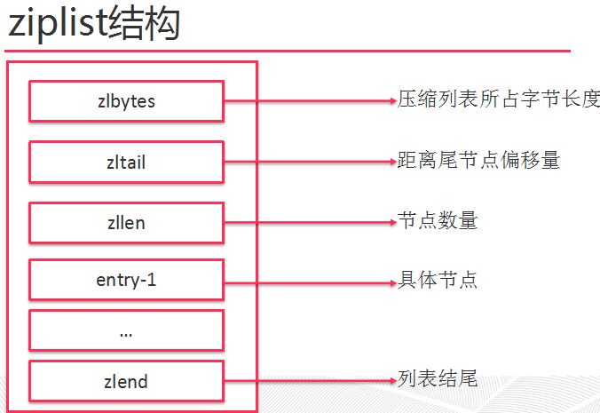

# redis

redis-cli -h 192.168.6.21 -p 6379

## 数据类型
Redis支持五种数据类型：string（字符串），hash（哈希），list（列表），set（集合）及zset(sorted set：有序集合)。

### String
string类型是二进制安全的。意思是redis的string可以包含任何数据。比如jpg图片或者序列化的对象。一个键最大能存储512MB。


- O(1)时间复杂度获取字符串长度、未使用长度、已使用长度
- 预分配机制，减少内存再分配次数
- 惰性删除机制，字符串缩减长度后的空间不释放，作为预分配保留
String在redis内部存储默认就是一个字符串，被redisObject所引用，当遇到incr,decr等操作时会转成数值型进行计算，此时redisObject的encoding字段为int。
命令：get/set

### Hash
Redis hash 是一个键值(key=>value)对集合
Redis Hash对应Value内部实际就是一个HashMap，实际这里会有2种不同实现，这个Hash的成员比较少时Redis为了节省内存会采用类似一维数组的方式来紧凑存储，而不会采用真正的HashMap结构，对应的value redisObject的encoding为zipmap,当成员数量增大时会自动转成真正的HashMap,此时encoding为ht。
命令：hget/hset

### List
Redis 列表是简单的字符串列表，按照插入顺序排序。你可以添加一个元素到列表的头部（左边）或者尾部（右边）。

Redis list的实现为一个双向链表，即可以支持反向查找和遍历，更方便操作，不过带来了部分额外的内存开销，Redis内部的很多实现，包括发送缓冲队列等也都是用的这个数据结构。

命令：lpush,rpush,lpop,rpop,lrange等。

### Set
Redis的Set是string类型的无序集合。

集合是通过哈希表实现的，所以添加，删除，查找的复杂度都是O(1)。

set 的内部实现是一个 value永远为null的HashMap，实际就是通过计算hash的方式来快速排重的，这也是set能提供判断一个成员是否在集合内的原因。

命令：zadd,zrange,zrem,zcard等

### zset
Redis zset 和 set 一样也是string类型元素的集合,且不允许重复的成员。
不同的是每个元素都会关联一个double类型的分数。redis正是通过分数来为集合中的成员进行从小到大的排序。

zset的成员是唯一的,但分数(score)却可以重复
edis sorted set的内部使用HashMap和跳跃表(SkipList)来保证数据的存储和有序，HashMap里放的是成员到score的映射，而跳跃表里存放的是所有的成员，排序依据是HashMap里存的score,使用跳跃表的结构可以获得比较高的查找效率，并且在实现上比较简单。


## 持久化
Redis 提供了多种不同级别的持久化方式：
- RDB 持久化可以在指定的时间间隔内生成数据集的时间点快照（point-in-time snapshot）。
- AOF 持久化记录服务器执行的所有写操作命令，并在服务器启动时，通过重新执行这些命令来还原数据集。 AOF 文件中的命令全部以 Redis 协议的格式来保存，新命令会被追加到文件的末尾。 Redis 还可以在后台对 AOF 文件进行重写（rewrite），使得 AOF 文件的体积不会超出保存数据集状态所需的实际大小。
- Redis 还可以同时使用 AOF 持久化和 RDB 持久化。 在这种情况下， 当 Redis 重启时， 它会优先使用 AOF 文件来还原数据集， 因为 AOF 文件保存的数据集通常比 RDB 文件所保存的数据集更完整。

### RDB(Redis DataBase)
Rdb:在指定的时间间隔内将内存中的数据集快照写入磁盘，也就是行话讲的 snapshot 快照，它恢复时就是将快照文件直接读到内存里。

Redis 会单独的创建(fork) 一个子进程来进行持久化，会先将数据写入到一个临时文件中，待持久化过程结束了，再用这个临时文件替换上次持久化还的文件。整个过程总，主进程是不进行任何 IO 操作，这就确保了极高的性能，如果需要进行大规模的数据恢复，且对于数据恢复的完整性不是非常敏感，那 RDB 方法要比 AOF 方式更加的高效。RDB 的缺点是最后一次持久化后的数据可能丢失。

Rdb 保存的是 dump.rdb 文件

触发快照
Save：save 时只管保存，其他不管，全部阻塞。
Bgsave：redis 会在后台进行快照操作，快照操作的同时还可以响应客户端的请求，可以通过 lastsave 命令获取最后一次成功执行快照的时间。
 执行 flushall 命令，也会产生 dump.rdb 文件，但里面是空的。

Rdb 是整个内存的压缩的 snapshot，RDB 的数据结构，可以配置符合快照触发条件，默认的是 1 分钟内改动 1 万次，或者 5 分钟改动 10 次，或者是 15 分钟改动一次；

如何恢复:
将备份文件(dump.rdb)移动到 redis 安装目录并启动服务即可
Config get dir 命令可获取目录

如何停止
动态停止 RDB 保存规则的方法：redis -cli config set save ""

### AOF(Append Only File)
以日志的形式俩记录每个写操作，将 redis 执行过的所有写指令记录下来(读操作不记录)。只许追加文件但不可以改写文件，redis 启动之初会读取该文件重新构建数据，换言之，redis重启的话就根据日志文件的内容将写指令从前到后执行一次一完成数据恢复工作。

开启aof:appendonly yes
aof文件损坏：(网络传输或者其他问题导致 aof 文件破坏)服务器启动报错(但是 dump.rdb 文件是完整的) 说明启动先加载 aof 文件
解决方案：执行命令 redis-check-aof --fix aof 文件 [自动检查删除不和 aof 语法的字段]

aof策略：Appendfsync 参数：

Always 同步持久化 每次发生数据变更会被立即记录到磁盘，性能较差但数据完整性较好。

Everysec： 出厂默认推荐，异步操作，每秒记录，日过一秒宕机，有数据丢失
Rewrite
概念：AOF 采用文件追加方式，文件会越来越来大为避免出现此种情况，新增了重写机制，aof 文件的大小超过所设定的阈值时，redis 就会自动 aof 文件的内容压缩，值保留可以恢复数据的最小指令集，可以使用命令 bgrewirteaof。
重写原理：aof 文件持续增长而大时，会 fork 出一条新进程来将文件重写(也就是先写临时文件最后再 rename)，遍历新进程的内存中的数据，每条记录有一条 set 语句，重写 aof 文件的操作，并没有读取旧的的 aof 文件，而是将整个内存的数据库内容用命令的方式重写了一个新的 aof 文件，这点和快照有点类似。
触发机制：redis 会记录上次重写的 aof 的大小，默认的配置当 aof 文件大小上次 rewrite 后大小的一倍且文件大于 64M 触发(3G)

no-appendfsync-on-rewrite no : 重写时是否可以运用 Appendfsync 用默认 no 即可，保证数据安全
auto-aof-rewrite-percentage  倍数 设置基准值

auto-aof-rewrite-min-size  设置基准值大小
AOF优点：

1、数据防丢失（）

2、数据可恢复（AOF 文件有序地保存了对数据库执行的所有写入操作， 这些写入操作以 Redis 协议的格式保存，举例：

对于误操作flashall可以， 但只要 AOF 文件未被重写， 那么只要停止服务器， 移除 AOF 文件末尾的 flashall命令。）

3、文件重写（因为 Redis 在创建新 AOF 文件的过程中，会继续将命令追加到现有的 AOF 文件里面，即使重写过程中发生停机，现有的 AOF 文件也不会丢失。 而一旦新 AOF 文件创建完毕，Redis 就会从旧 AOF 文件切换到新 AOF 文件，并开始对新 AOF 文件进行追加操作）
4、写入不需要进行 seek（AOF 文件是一个只进行追加操作的日志文件（append only log），即使偶发的网路异常，也可使用redis-check-aof 工具修复）
AOF缺点：数据文件大，恢复数据慢。

link:https://blog.csdn.net/bohu83/article/details/79625285

## 请求/响应协议和RTT(Round Trip Time - 往返时间)

客户端和服务器通过网络进行连接。这个连接可以很快（loopback接口）或很慢（建立了一个多次跳转的网络连接）。无论网络延如何延时，数据包总是能从客户端到达服务器，并从服务器返回数据回复客户端。

## pipelining

一次请求/响应服务器能实现处理新的请求即使旧的请求还未被响应。这样就可以将多个命令发送到服务器，而不用等待回复，最后在一个步骤中读取该答复

重要说明: 使用管道发送命令时，服务器将被迫回复一个队列答复，占用很多内存。所以，如果你需要发送大量的命令，最好是把他们按照合理数量分批次的处理，例如10K的命令，读回复，然后再发送另一个10k的命令，等等。这样速度几乎是相同的，但是在回复这10k命令队列需要非常大量的内存用来组织返回数据内容。

## 内存优化

Redis2.2版本及以后，存储集合数据的时候会采用内存压缩技术，以使用更少的内存存储更多的数据。如Hashes,Lists,Sets和Sorted Sets，当这些集合中的所有数都小于一个给定的元素，并且集合中元素数量小于某个值时，存储的数据会被以一种非常节省内存的方式进行编码，使用这种编码理论上至少会节省10倍以上内存（平均节省5倍以上内存）。并且这种编码技术对用户和redis api透明。因为使用这种编码是用CPU换内存，所以我们提供了更改阈值的方法，只需在redis.conf里面进行修改即可.

```
hash-max-zipmap-entries 64 (2.6以上使用hash-max-ziplist-entries)
hash-max-zipmap-value 512  (2.6以上使用hash-max-ziplist-value)
list-max-ziplist-entries 512
list-max-ziplist-value 64
zset-max-ziplist-entries 128
zset-max-ziplist-value 64
set-max-intset-entries 512
```

（集合中）如果某个值超过了配置文件中设置的最大值，redis将自动把把它（集合）转换为正常的散列表。这种操作对于比较小的数值是非常快的，但是，如果你为了使用这种编码技术而把配置进行了更改，你最好做一下基准测试（和正常的不采用编码做一下对比）.

### 使用32位的redis

使用32位的redis，对于每一个key,将使用更少的内存，因为32位程序，指针占用的字节数更少。但是32的redis整个实例使用的内存将被限制在4G以下。使用make 32bit命令编译生成32位的redis。RDB和AOF文件是不区分32位和64位的（包括字节顺序）,所以你可以使用64位的reidis恢复32位的RDB备份文件，相反亦然.

### 位级别和字级别的操作

Redis 2.2引入了位级别和字级别的操作: GETRANGE, SETRANGE, GETBIT 和 SETBIT.使用这些命令，你可以把redis的字符串当做一个随机读取的（字节）数组。例如你有一个应用，用来标志用户的ID是连续的整数，你可以使用一个位图标记用户的性别，使用1表示男性，0表示女性，或者其他的方式。这样的话，1亿个用户将仅使用12 M的内存。你可以使用同样的方法，使用 GETRANGE 和 SETRANGE 命令为每个用户存储一个字节的信息。这仅是一个例子，实际上你可以使用这些原始数据类型解决更多问题。


### 尽可能使用散列表（hashes）

一般而言，把一个模型（model）表示为key-value的形式存储在redis中非常容易，当然value必须为字符串，这样存储不仅比一般的key value存储高效，并且比memcached存储还高效.

### 内存分配

为了存储用户数据,当设置了maxmemory后Redis会分配几乎和maxmemory一样大的内存（然而也有可能还会有其他方面的一些内存分配）.

精确的值可以在配置文件中设置，或者在启动后通过 CONFIG SET 命令设置(see Using memory as an LRU cache for more info). Redis内存管理方面，你需要注意以下几点:

- 当某些缓存被删除后Redis并不是总是立即将内存归还给操作系统。这并不是redis所特有的，而是函数malloc()的特性。例如你缓存了5G的数据，然后删除了2G数据，从操作系统看，redis可能仍然占用了5G的内存（这个内存叫RSS,后面会用到这个概念），即使redis已经明确声明只使用了3G的空间。这是因为redis使用的底层内存分配器不会这么简单的就把内存归还给操作系统，可能是因为已经删除的key和没有删除的key在同一个页面（page）,这样就不能把完整的一页归还给操作系统.
- 上面的一点意味着，你应该基于你可能会用到的 最大内存 来指定redis的最大内存。如果你的程序时不时的需要10G内存，即便在大多数情况是使用5G内存，你也需要指定最大内存为10G.
- 内存分配器是智能的，可以复用用户已经释放的内存。所以当使用的内存从5G降低到3G时，你可以重新添加更多的key，而不需要再向操作系统申请内存。分配器将复用之前已经释放的2G内存.
- 因为这些，当redis的peak内存非常高于平时的内存使用时，碎片所占可用内存的比例就会波动很大。当前使用的内存除以实际使用的物理内存（RSS）就是fragmentation；因为RSS就是peak memory，所以当大部分key被释放的时候，此时内存的mem_used / RSS就比较高.

如果 maxmemory 没有设置，redis就会一直向OS申请内存，直到OS的所有内存都被使用完。所以通常建议设置上redis的内存限制。或许你也想设置 maxmemory-policy 的值为 noeviction（在redis的某些老版本默认 并 不是这样）

设置了maxmemory后，当redis的内存达到内存限制后，再向redis发送写指令，会返回一个内存耗尽的错误。错误通常会触发一个应用程序错误，但是不会导致整台机器宕掉.