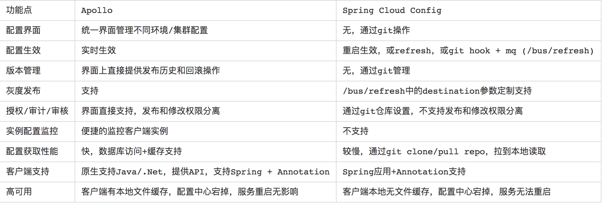

# spring cloud

## 注册/发现
常见的注册中心有zookeeper 、eureka、consul、etcd、nacos

| Feature | Consul| Zookeeper| Etcd| Eureka| nacos|
| -----   | ----- | ----- | ----- | ----- | ----- |
| 服务健康检查 | 服务状态，内存，硬盘等|(弱)长连接，keepalive | 连接心跳| 可配支持| --|
| 多数据中心 | 支持 |  — |  — |  — |  — |  — |
| kv存储服务 | 支持 | 支持 | 支持 | 支持 |  支持 | 
| 一致性 | raft | paxos | raft |  — |  — | 
| CAP定理 | CP |  CP |  CP |  AP |  AP&CP | 
| 使用接口 | 支持http和dns | 客户端 | http/grpc | http（sidecar） | 支持http和dns | 
| watch支持 | 全量/支持long polling |  支持 |  支持 long polling | 支持 long polling/大部分增量 |  — | 
| 自身监控 | metrics | -- | metrics | metrics |  — | 
| 安全 | acl /https |  acl | https支持（弱） | — | — || Spring Cloud集成 | 已支持 | 已支持 | 已支持 | 已支持 | — |

- 服务的健康检查
Euraka 使用时需要显式配置健康检查支持；Zookeeper,Etcd 则在失去了和服务进程的连接情况下任务不健康，而 Consul 相对更为详细点，比如内存是否已使用了90%，文件系统的空间是不是快不足了。

- 多数据中心支持
Consul 通过 WAN 的 Gossip 协议，完成跨数据中心的同步；而且其他的产品则需要额外的开发工作来实现

- KV 存储服务
除了 Eureka ,其他几款都能够对外支持 k-v 的存储服务，所以后面会讲到这几款产品追求高一致性的重要原因。而提供存储服务，也能够较好的转化为动态配置服务哦。

- 产品设计中 CAP 理论的取舍
Eureka 典型的 AP,作为分布式场景下的服务发现的产品较为合适，服务发现场景的可用性优先级较高，一致性并不是特别致命。Consul也能提供较高的可用性，并能 k-v store 服务保证一致性。 而Zookeeper,Etcd则是CP类型 牺牲可用性，在服务发现场景并没太大优势；

- 多语言能力与对外提供服务的接入协议
Zookeeper的跨语言支持较弱，其他几款支持 http11 提供接入的可能。Euraka 一般通过 sidecar的方式提供多语言客户端的接入支持。Etcd 还提供了Grpc的支持。 Consul除了标准的Rest服务api,还提供了DNS的支持

- Watch的支持（客户端观察到服务提供者变化）
Zookeeper 支持服务器端推送变化，Eureka 2.0(正在开发中)也计划支持。 Eureka 1,Consul,Etcd则都通过长轮询的方式来实现变化的感知；

- 自身集群的监控
除了 Zookeeper ,其他几款都默认支持 metrics，运维者可以搜集并报警这些度量信息达到监控目的；

- 安全
Consul,Zookeeper 支持ACL，另外 Consul,Etcd 支持安全通道https.

see：https://blog.csdn.net/weixin_38055381/article/details/84138952

### CAP
CAP原则，指的是在一个分布式系统中，Consistency(一致性)、Availability(可用性)、Partition Tolerance(分区容错性)，不能同时成立。
一致性：它要求在同一时刻点，分布式系统中的所有数据备份都处于同一状态。
可用性：在系统集群的一部分节点宕机后，系统依然能够响应用户的请求。
分区容错性：在网络区间通信出现失败，系统能够容忍。

## 配置中心
spring cloud config、携程apollo、nacos

对比:


## 网关
zuul、spring cloud gateway、envoy

- 动态路由
从注册中心获取数据的时候，会维持一个HeartbeatEvent，里面包含一个state值，当注册中心有变动的时候，这个状态值就会变化(+1??)，这边在RouteRefreshListener里面有一个HeartbeatMonitor monitor，记录上次的state值，如果发生变化就refresh
```java
private void reset() {
		this.publisher.publishEvent(new RefreshRoutesEvent(this));
	}
```
CachingRouteLocator.java会监听该事件并refresh
```java
public CachingRouteLocator(RouteLocator delegate) {
		this.delegate = delegate;
		routes = CacheFlux.lookup(cache, "routes", Route.class)
				.onCacheMissResume(() -> this.delegate.getRoutes().sort(AnnotationAwareOrderComparator.INSTANCE));
	}

public Flux<Route> refresh() {
		this.cache.clear();
		return this.routes;
	}
```
- Predicates 和 Filters 作用于特定路由
- 集成 Hystrix 断路器
- 集成 Spring Cloud DiscoveryClient
- 易于编写的 Predicates 和 Filters
- 限流
- 路径重写

## RPC
feign client、dubbo

## 负载均衡
ribbon

## 熔断
hystrix、resilience4j、Sentinel

## 路径追踪
sleuth+zipkin、pingpoint

sleuth做日志记录，可以发送到prometheus、es或者时序数据库中
```java
<dependency>
    <groupId>io.micrometer</groupId>
    <artifactId>micrometer-registry-prometheus</artifactId>//发送sleuth数据到prometheus
</dependency>
<dependency>
    <groupId>io.micrometer</groupId>
    <artifactId>micrometer-registry-influx</artifactId>//发送sleuth数据到influx数据库
</dependency>
```
zipkin可以从mq获取数据保存到数据库或者es中，并有操作界面可以查询.（需要引入jar包扩展）

zipkin界面更加直观