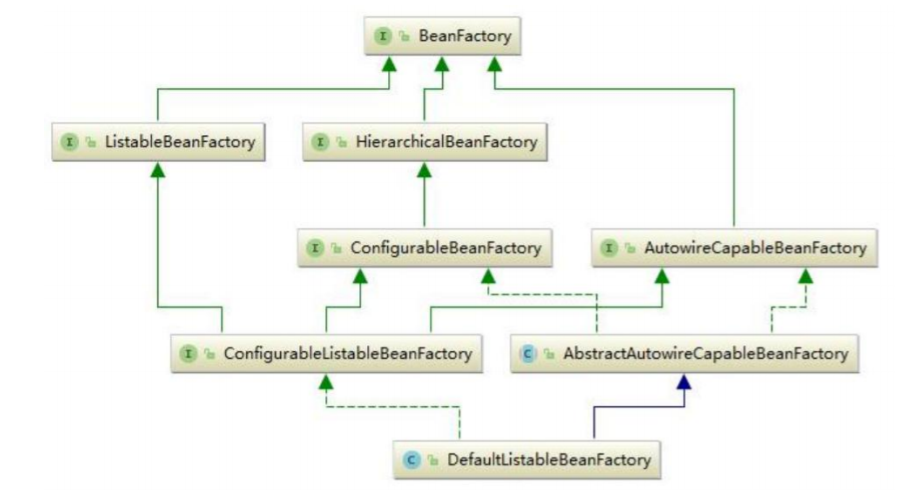

# spring源码阅读

## IOC
1. AbstractApplicationContext的refresh()开始载入beandefinition
2. 如果是sig

## AOP
SPRING 通过注解实现AOP的过程的文字描述 - xml配置文件中声明自动发现注解(),spring默认启动时会注册注解解析器(AspectJAutoProxyBeanDefinitionParser)，在注解解析器解析（parse）的过程中，会注册一个实现了BeanPostProcessor的后处理器(AspectJAwareAdvisorAutoProxyCreator),这个后处理器在目标对象实例化后进行拦截处理，拦截的流程是，先搜索所有已经注册的BeanDefiniton,从中找到标记了注解(@Aspect)的切面组成拦截器链，选择那些可以应用到目标对象的拦截器（过滤），如果拦截器链不为空，则为目标对象生成代理(JdkDynamicAopProxy或CglibAopProxy)，当调用目标对象的指定拦截方法时，就会默认调用对应代理类的代理方法(invoke)，这样就完成了AOP的整个流程

- 连接点：目标类的方法，ReflectiveMethodInvocation
- 切点：一般配置为AspectJ的表达式，AspectJExpressionPointcut
- Advice: 
1. 前置通知（Before advice）- 在目标方便调用前执行通知
2. 后置通知（After advice）- 在目标方法完成后执行通知
3. 返回通知（After returning advice）- 在目标方法执行成功后，调用通知
4. 异常通知（After throwing advice）- 在目标方法抛出异常后，执行通知
5. 环绕通知（Around advice）- 在目标方法调用前后均可执行自定义逻辑
- 切面：@Aspect类，AspectJPointcutAdvisor
- weaving：在切点的引导下，将通知逻辑插入到方法调用上

## BeanFactory
共同定义了Bean的集合、Bean之间的关系、Bean的行为

- ListableBeanFactory
表示这些Bean是可列表的
- HierarchicalBeanFactory
表示这些Bean是有继承关系的
- AutowireCapableBeanFactory
定义Bean的自动装配规则
- DefaultListableBeanFactory
默认实现类



### ApplicationContext
高级IOC容器，包含Beanfactory的所有功能，另外还有以下功能：
- 支持实现国际化(实现MessageSource接口)
- 访问资源(实现ResourcePatternResolver接口)
- 支持应用事件(实现ApplicationEventPublisher接口)


## BeanDefinition
Bean对象在Spring中以BeanDefinition来描述

## AbstractApplicationContext
AbstractApplicationContext 的 refresh 函数载入 Bean 定义过程：
SpringIOC 容器对 Bean 定义资源的载入是从 refresh()函数开始的，refresh()是一个模板方法，refresh()方法的作用
是：在创建 IOC 容器前，如果已经有容器存在，则需要把已有的容器销毁和关闭，以保证在 refresh 之后使用的
是新建立起来的 IOC 容器。refresh 的作用类似于对 IOC 容器的重启，在新建立好的容器中对容器进行初始化，对
Bean 定义资源进行载入

```java
@Override
	public void refresh() throws BeansException, IllegalStateException {
		synchronized (this.startupShutdownMonitor) {
			// 调用容器准备刷新的方法，获取容器的当时时间，设置同步标识
			prepareRefresh();
			// 告诉子类启动refreshBeanFactory()方法，Bean定义资源文件的载入从子类的refreshBeanFactory()启动
			ConfigurableListableBeanFactory beanFactory = obtainFreshBeanFactory();
			// 为BeanFactory配置容器特性，例如类加载器、事件处理器
			prepareBeanFactory(beanFactory);
			try {
				// 为容器的某些子类指定特殊的BeanPost事件处理器
				postProcessBeanFactory(beanFactory);
				// 调用所有注册的BeanFactoryPostProcessor的Bean
				invokeBeanFactoryPostProcessors(beanFactory);
				// 为BeanFactory注册BeanPost事件处理器.BeanPostProcessor是Bean后置处理器,用于监听容器出发的事件
				registerBeanPostProcessors(beanFactory);
				// 初始化信息源，国际化
				initMessageSource();
				// 初始化容器事件传播器
				initApplicationEventMulticaster();
				// 调用子类的某些特殊Bean初始化方法
				onRefresh();
				// 为事件传播器注册事件监听器
				registerListeners();
				// 初始化单例Bean
				finishBeanFactoryInitialization(beanFactory);
				// 初始化容器的声明周期事件处理器，并发布容器的生命周期事件
				finishRefresh();
			}

			catch (BeansException ex) {
				if (logger.isWarnEnabled()) {
					logger.warn("Exception encountered during context initialization - " +
							"cancelling refresh attempt: " + ex);
				}

				// 销毁已创建的Beans
				destroyBeans();
				// 去掉refresh，重置容器的同步标识
				cancelRefresh(ex);
				// Propagate exception to caller.
				throw ex;
			}

			finally {
				// Reset common introspection caches in Spring's core, since we
				// might not ever need metadata for singleton beans anymore...
				resetCommonCaches();
			}
		}
	}
```