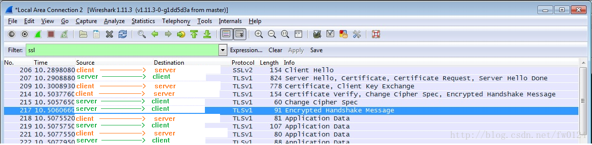
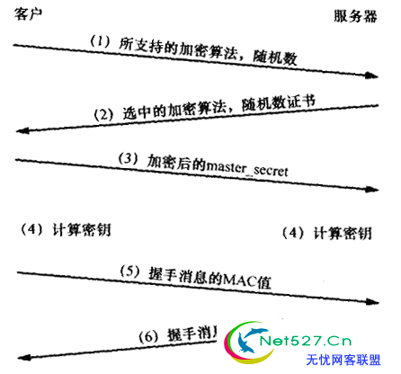

# SSL

## 交互过程
- client hello 
客户端发送服务器信息，包括它所支持的**密码组**。密码组中有**密码算法**和**钥匙大小**； 
- server hello 
服务器选择客户端和服务器都支持的密码组到客户端。 
- sever certificate 
服务器发送一个证书或一个证书链到客户端，一个证书链开始于服务器公共钥匙证书并结束于证明权威的根证书。这个消息是可选的，但服务器证书需要时，必须使用它。
- client certificate request(optional)
当服务器需要鉴别客户端时，它发送一个证书请求到客户端。在网络程序中，这个消息很少发送。
- server key exchange
服务器当发送来的公共钥匙对钥匙交换不是很充分时，发送一个服务器钥匙交换消息。(对于使用DHE/ECDHE非对称密钥协商算法的SSL握手，将发送该类型握手。
RSA算法不会继续该握手流程（DH、ECDH也不会发送server key exchange）。)
see:https://blog.csdn.net/mrpre/article/details/77867831
- server hello done
服务器告诉客户完成它的初始化流通消息。 
- client certificate 
假如服务器需要一个客户证书时，客户端发送一个证书链。(只有在服务器需要客户证书时) 
- client key exchange
客户端产生用于对称算法的一个钥匙。对RSA客户端用服务器公共钥匙加密这个钥匙信息并把它送到服务器。 
- certificate verify
在网络程序中，这个消息很少发送，它主要是用来允许服务器结束对客户的鉴别处理。当用这个消息时，客户端发送用密码函数的数字签名的信息到服务端，当服务端用公共钥匙解密这个消息时，服务器能够鉴别客户端。 
- change cipher spec 
客户端发送一个消息告诉服务器改变加密模式。 
- finished
客户端告诉服务器已经准备安全数据通信
- change cipher spec
服务器发送一个消息到客户端并告诉客户端修改加密模式
- finished
服务器告诉客户端已准备好安全数据通信
- encrypted data
客户端与服务器用对称加密算法和密码函数，且使用酷虎段发送到服务器的密钥加密通讯

目的：
1. 客户端和服务器需要就一组用于保护数据的算法达成一致
2. 他们需要确立一组由那些算法所使用的加密密钥
3. 我受还可以选择对客户端进行认证

| Client         | Server|
| -----          | ----- |
| 1.Client Hello |       |
|                | 2.Server Hello 3.certificate 4.(server_key_exchange) 5.(certificate_request) 6.server_hello_done |
| 7.(certificate) 8.client_key_exchange 9.(certifiate_verify) 10.change_cypher_spec ----finished----  |   |
|                | 11. change_cypher_spec ----finished----  |

单向认证不需要5/7/9步骤

see:https://blog.csdn.net/fw0124/article/details/40983787

说明:
1. 客户端将它所支持的算法列表和一个用作产生密钥的随机数发送给服务器； 
2. 服务器从算法列表中选择一种加密算法，并将它和一份包含服务器公用密钥的证书发送给客户端；该证书还包含了用于认证目的的服务器标识，服务器同时还提供了一个用作产生密钥的随机数； 
3. 客户端对服务器的证书进行验证(有关验证证书，可以参考数字签名)，并抽取服务器的公用密钥；然后，再产生一个称作pre_master_secret的随机密码串，并使用服务器的公用密钥对其进行加密(参考非对称加/解密)，并将加密后的信息发送给服务器； 
4. 客户端与服务器端根据pre_master_secret以及客户端与服务器的随机数值独立计算出加密和MAC密钥(参考DH密钥交换算法)。 
5. 客户端将所有握手消息的MAC值发送给服务器； 
6. 服务器将所有握手消息的MAC值发送给客户端。

　第5与第6步用以防止握手本身遭受篡改。设想一个攻击者想要控制客户端与服务器所使用的算法。客户端提供多种算法的情况相当常见，某些强度弱而某些强度 强，以便能够与仅支持弱强度算法的服务器进行通信。攻击者可以删除客户端在第1步所提供的所有高强度算法，于是就迫使服务器选择一种弱强度的算法。第5步与第6步的MAC交换就能阻止这种攻击，因为客户端的MAC是根据原始消息计算得出的，而服务器的MAC是根据攻击者修改过的消息计算得出的，这样经过检 查就会发现不匹配。由于客户端与服务器所提供的随机数为密钥产生过程的输入，所以握手不会受到重放攻击的影响。这些消息是首个在新的加密算法与密钥下加密 的消息。

## 单向认证
1. 客户端向服务器发送消息，服务器接到消息后，用服务器端的密钥库中的私钥对数据进行加密，然后把加密后的数据和服务器端的公钥一起发送到客户端
2. 客户端用服务器发送来的公钥对数据解密，然后再用传到客户端的服务器公钥对数据加密传给服务器端，服务器用私钥对数据进行解密，这就完成了客户端 和服务器之间通信的安全问题，但是单向认证没有验证客户端的合法性。

## 双向认证
1. 客户端向服务器发送消息，首先把消息用客户端证书加密然后连同时把客户端证书一起发送到服务器端

2. 服务器接到消息后用首先用客户端证书把消息解密，然后用服务器私钥把消息加密，把服务器证书和消息一起发送到客户端

3. 客户端用发来的服务器证书对消息进行解密，然后用服务器的证书对消息加密，然后在用客户端的证书对消息在进行一次加密，连同加密消息和客户端证书一起发送到服务器端，

4. 到服务器端首先用客户端传来的证书对消息进行解密，确保消息是这个客户发来的，然后用服务器端的私钥对消息在进行解密这个便得到了明文数据。