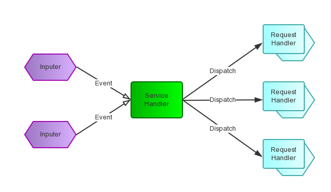

# webflux

## reactor模型
在Reactor中，这些被拆分的小线程或者子过程对应的是handler，每一种handler会出处理一种event。这里会有一个全局的管理者selector，我们需要把channel注册感兴趣的事件，那么这个selector就会不断在channel上检测是否有该类型的事件发生，如果没有，那么主线程就会被阻塞，否则就会调用相应的事件处理函数即handler来处理。典型的事件有连接，读取和写入，当然我们就需要为这些事件分别提供处理器，每一个处理器可以采用线程的方式实现。一个连接来了，显示被读取线程或者handler处理了，然后再执行写入，那么之前的读取就可以被后面的请求复用，吞吐量就提高了。

### 阻塞模型

- serversocket的accept方法，阻塞等待client连接，直到有连接成功
- 线程从socket inputstream读入数据，会进入阻塞状态，直到数据全部读完
- 线程向socket outputstream写入数据，会阻塞直到写完全部数据

### 基于事件驱动的reactor模型

- reactor负责响应I/O事件，当检测倒一个新事件，发送给相应的Handler处理
- handler负责处理非阻塞的行为，标识系统管理的资源，同时将handler与事件绑定
- reactor为单个线程，需要处理accept连接，同时发送请求到处理器中

### 多线程reactor

这里的多线程指的是业务处理多线程，reactor仍然为单个线程

### 2级reactor

- mainReactor负责监听连接，accept连接给subReactor处理

### handler

## 结构

- handle: 操作系统中的句柄，是对资源的一种抽象，可以是打开的文件，socket连接，timer等。这里一般指Socket Handle，对应JAVA NIO中的Channel，Channel注册到Synchronous Event Demultiplexer中，对SocketChannel可以是READ/WRITE/CLOSE等事件.
- Synchronous Event Demultiplexer: 阻塞等待一系列的Hadnle中的事件到来，如果阻塞等待返回，即表示在返回的handle中可以不阻塞的执行返回的事件类型。这个模块一般使用操作系统的select来实现。在JAVA NIO中使用Selector来封装，当Selector.select()返回时，可以调用Selector的selectedKeys()方法来获取Set<SelectionKey>, 一个SelectionKey表达一个有事件发生的Channel以及该Channel上的事件类型.
- Initiation Dispatcher: 用于管理Event Handler，即EventHandler的容器。用以注册，移除EventHandler等，它还作为Reactor模式的入口调用Synchronous Event Demultiplexer的select方法以阻塞等待事件返回，当阻塞等待返回时，根据事件发生的Handle将其风阀给对应的Event Handle处理.
- Event Handler: 定义事件处理方法，handle_event(),作为InitiationDispatcher回调使用
- Concrete Event Handler: 事件EventHandler接口，实现特定事件处理逻辑.

## 理解
webflux用的是reactor的模型，对之后的操作需要是非阻塞的，不会长时间占用当前线程，不然会造成性能损失，

- 优点:
1）响应快，不必为单个同步时间所阻塞，虽然Reactor本身依然是同步的； 
2）编程相对简单，可以最大程度的避免复杂的多线程及同步问题，并且避免了多线程/进程的切换开销； 
3）可扩展性，可以方便的通过增加Reactor实例个数来充分利用CPU资源； 
4）可复用性，reactor框架本身与具体事件处理逻辑无关，具有很高的复用性；

- 缺点:
1）相比传统的简单模型，Reactor增加了一定的复杂性，因而有一定的门槛，并且不易于调试。 
2）Reactor模式需要底层的Synchronous Event Demultiplexer支持，比如Java中的Selector支持，操作系统的select系统调用支持，如果要自己实现Synchronous Event Demultiplexer可能不会有那么高效。 
3） Reactor模式在IO读写数据时还是在同一个线程中实现的，即使使用多个Reactor机制的情况下，那些共享一个Reactor的Channel如果出现一个长时间的数据读写，会影响这个Reactor中其他Channel的相应时间，比如在大文件传输时，IO操作就会影响其他Client的相应时间，因而对这种操作，使用传统的Thread-Per-Connection或许是一个更好的选择，或则此时使用Proactor模式。