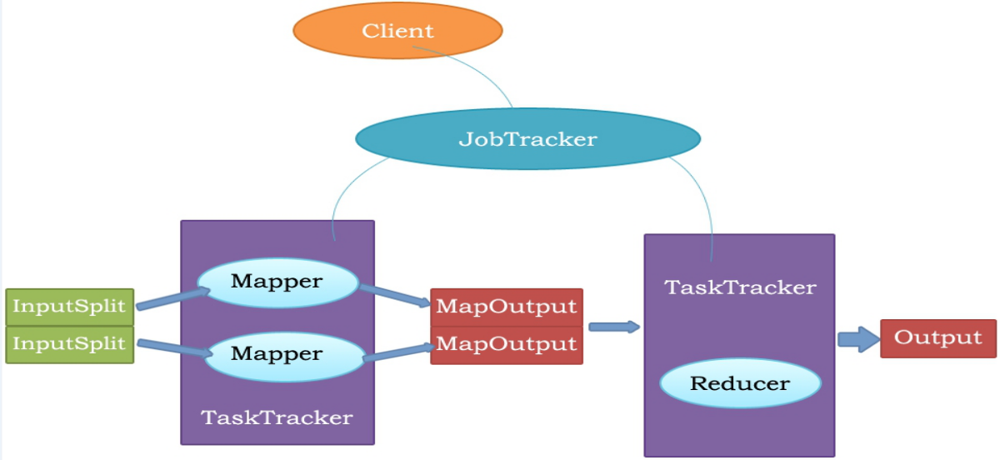
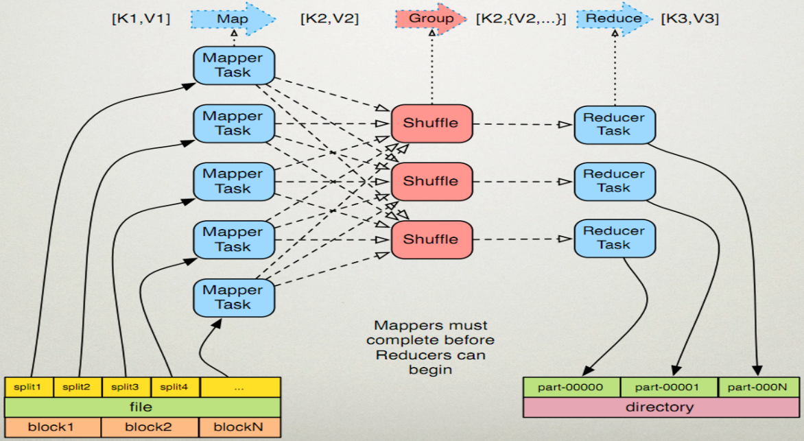

# 大数据

## HDFS
HDFS是GFS的一种实现,Hadoop HDFS为HBase提供了高可靠性的底层存储支持，Hadoop MapReduce为HBase提供了高性能的计算能力，Zookeeper为HBase提供了稳定服务和failover机制。Pig和Hive还为HBase提供了高层语言支持，使得在HBase上进行数据统计处理变的非常简单。 Sqoop则为HBase提供了方便的RDBMS（关系型数据库）数据导入功能，使得传统数据库数据向HBase中迁移变的非常方便。

## hbase
HBase是Google Bigtable的开源实现，类似Google Bigtable利用GFS作为其文件存储系统，HBase利用Hadoop HDFS作为其文件存储系统；Google运行MapReduce来处理Bigtable中的海量数据，HBase同样利用Hadoop MapReduce来处理HBase中的海量数据

## MapReduce
- MapReduce是一种分布式计算模型，是Google提出的，主要用于搜索领域，解决海量数据的计算问题。
- MR有两个阶段组成：Map和Reduce，用户只需实现map()和reduce()两个函数，即可实现分布式计算。

步骤：
1、Map任务处理
　　1.1 读取HDFS中的文件。每一行解析成一个<k,v>。每一个键值对调用一次map函数。                <0,hello you>   <10,hello me>                    
　　1.2 覆盖map()，接收1.1产生的<k,v>，进行处理，转换为新的<k,v>输出。　　　　　　　　　　<hello,1> <you,1> <hello,1> <me,1>
　　1.3 对1.2输出的<k,v>进行分区。默认分为一个区。详见《Partitioner》
　　1.4 对不同分区中的数据进行排序（按照k）、分组。分组指的是相同key的value放到一个集合中。　排序后：<hello,1> <hello,1> <me,1> <you,1>  分组后：<hello,{1,1}><me,{1}><you,{1}>
　　1.5 （可选）对分组后的数据进行归约。详见《Combiner》
2、Reduce任务处理
　　2.1 多个map任务的输出，按照不同的分区，通过网络copy到不同的reduce节点上。（shuffle）详见《shuffle过程分析》
　　2.2 对多个map的输出进行合并、排序。覆盖reduce函数，接收的是分组后的数据，实现自己的业务逻辑，　<hello,2> <me,1> <you,1>处理后，产生新的<k,v>输出。
　　2.3 对reduce输出的<k,v>写到HDFS中。

## yarn
Apache Hadoop YARN （Yet Another Resource Negotiator，另一种资源协调者）是一种新的 Hadoop 资源管理器，它是一个通用资源管理系统，可为上层应用提供统一的资源管理和调度，它的引入为集群在利用率、资源统一管理和数据共享等方面带来了巨大好处。

YARN的基本思想是将JobTracker的两个主要功能（资源管理和作业调度/监控）分离，主要方法是创建一个全局的ResourceManager（RM）和若干个针对应用程序的ApplicationMaster（AM）。这里的应用程序是指传统的MapReduce作业或作业的DAG（有向无环图）。

YARN 分层结构的本质是 ResourceManager。这个实体控制整个集群并管理应用程序向基础计算资源的分配。ResourceManager 将各个资源部分（计算、内存、带宽等）精心安排给基础 NodeManager（YARN 的每节点代理）。ResourceManager 还与 ApplicationMaster 一起分配资源，与 NodeManager 一起启动和监视它们的基础应用程序。在此上下文中，ApplicationMaster 承担了以前的 TaskTracker 的一些角色，ResourceManager 承担了 JobTracker 的角色。

ApplicationMaster 管理一个在 YARN 内运行的应用程序的每个实例。ApplicationMaster 负责协调来自 ResourceManager 的资源，并通过 NodeManager 监视容器的执行和资源使用（CPU、内存等的资源分配）。请注意，尽管目前的资源更加传统（CPU 核心、内存），但未来会带来基于手头任务的新资源类型（比如图形处理单元或专用处理设备）。从 YARN 角度讲，ApplicationMaster 是用户代码，因此存在潜在的安全问题。YARN 假设 ApplicationMaster 存在错误或者甚至是恶意的，因此将它们当作无特权的代码对待。

NodeManager 管理一个 YARN 集群中的每个节点。NodeManager 提供针对集群中每个节点的服务，从监督对一个容器的终生管理到监视资源和跟踪节点健康。MRv1 通过插槽管理 Map 和 Reduce 任务的执行，而 NodeManager 管理抽象容器，这些容器代表着可供一个特定应用程序使用的针对每个节点的资源。YARN 继续使用 HDFS 层。它的主要 NameNode 用于元数据服务，而 DataNode 用于分散在一个集群中的复制存储服务。

## hive
hive是基于Hadoop的一个数据仓库工具，可以将结构化的数据文件映射为一张数据库表，并提供简单的sql查询功能，可以将sql语句转换为MapReduce任务进行运行

## Spark
Spark 是专为大规模数据处理而设计的快速通用的计算引擎，其是基于内存的迭代式计算。
Spark 保留了MapReduce 的优点，而且在时效性上有了很大提高，从而对需要迭代计算和有较高时效性要求的系统提供了很好的支持。
多用于能容忍小延时的推荐与计算系统。

## Storm
Storm是一个分布式的、可靠的、容错的流式计算框架。
Storm可应用于--数据流处理、持续计算（持续地向客户端发送数据，它们可以实时的更新以及展现数据，比如网站指标）、分布式远程过程调用（轻松地并行化CPU密集型操作）。

## Flink
Flink核心是一个流式的数据流执行引擎，其针对数据流的分布式计算提供了数据分布、数据通信以及容错机制等功能。

### 基本架构

当 Flink 集群启动后，首先会启动一个 JobManger 和一个或多个的 TaskManager。由 Client 提交任务给 JobManager， JobManager 再调度任务到各个 TaskManager 去执行，然后 TaskManager 将心跳和统计信息汇报给 JobManager。 TaskManager 之间以流的形式进行数据的传输。上述三者均为独立的 JVM 进程。

#### Client
Client 为提交 Job 的客户端，可以是运行在任何机器上（与 JobManager 环境连通即可）。提交 Job 后，Client 可以结束进程 （Streaming的任务），也可以不结束并等待结果返回。

当用户提交一个Flink程序时，会首先创建一个Client，该Client首先会对用户提交的Flink程序进行预处理，并提交到Flink集群中处 理，所以Client需要从用户提交的Flink程序配置中获取JobManager的地址，并建立到JobManager的连接，将Flink Job提交给 JobManager。Client会将用户提交的Flink程序组装一个JobGraph， 并且是以JobGraph的形式提交的。一个JobGraph是一个 Flink Dataflow，它由多个JobVertex组成的DAG。其中，一个JobGraph包含了一个Flink程序的如下信息：JobID、Job名称、配 置信息、一组JobVertex等。

#### JobManager
JobManager 主要负责调度 Job 并协调 Task 做 checkpoint，职责上很像 Storm 的 Nimbus。从 Client 处接收到 Job 和 JAR 包 等资源后，会生成优化后的执行计划，并以 Task 的单元调度到各个 TaskManager 去执行。

JobManager所负责的各项管理功能，它接收到并处理的事件主要包括：
- RegisterTaskManager
在Flink集群启动的时候，TaskManager会向JobManager注册，如果注册成功，则JobManager会向TaskManager回复消息 AcknowledgeRegistration。

- SubmitJob
Flink程序内部通过Client向JobManager提交Flink Job，其中在消息SubmitJob中以JobGraph形式描述了Job的基本信息。

- CancelJob
请求取消一个Flink Job的执行，CancelJob消息中包含了Job的ID，如果成功则返回消息CancellationSuccess，失败则返回消息 CancellationFailure。

- UpdateTaskExecutionState
TaskManager会向JobManager请求更新ExecutionGraph中的ExecutionVertex的状态信息，更新成功则返回true。

- RequestNextInputSplit
运行在TaskManager上面的Task，请求获取下一个要处理的输入Split，成功则返回NextInputSplit。

#### TaskManager 
TaskManager 在启动的时候就设置好了槽位数（Slot），每个 slot 能启动一个 Task，Task 为线程。从 JobManager 处接收需要 部署的 Task，部署启动后，与自己的上游建立 Netty 连接，接收数据并处理。

TaskManager端可以分成两个 阶段：
- 注册阶段
TaskManager会向JobManager注册，发送RegisterTaskManager消息，等待JobManager返回AcknowledgeRegistration，然 后TaskManager就可以进行初始化过程。

- 可操作阶段
该阶段TaskManager可以接收并处理与Task有关的消息，如SubmitTask、CancelTask、FailTask。如果TaskManager无法连接 到JobManager，这是TaskManager就失去了与JobManager的联系，会自动进入“注册阶段”，只有完成注册才能继续处理Task 相关的消息。

基于流执行引擎，Flink提供了诸多更高抽象层的API以便用户编写分布式任务：

- DataSet API， 对静态数据进行批处理操作，将静态数据抽象成分布式的数据集，用户可以方便地使用Flink提供的各种操作符对分布式数据集进行处理，支持Java、Scala和Python。

- DataStream API，对数据流进行流处理操作，将流式的数据抽象成分布式的数据流，用户可以方便地对分布式数据流进行各种操作，支持Java和Scala。

- Table API，对结构化数据进行查询操作，将结构化数据抽象成关系表，并通过类SQL的DSL对关系表进行各种查询操作，支持Java和Scala。

### 统一的批处理与流处理系统
在统一的流式执行引擎基础上，Flink同时支持了流计算和批处理，并对性能（延迟、吞吐量等）有所保障。相对于其他原生的流处理与批处理系统，并没有因为统一执行引擎而受到影响从而大幅度减轻了用户安装、部署、监控、维护等成本。

### Flink流处理的容错机制
按照用户自定义的分布式快照间隔时间，Flink会定时在所有数据源中插入一种特殊的快照标记消息，这些快照标记消息和其他消息一样在DAG中流动，但是不会被用户定义的业务逻辑所处理，每一个快照标记消息都将其所在的数据流分成两部分：本次快照数据和下次快照数据。

快照标记消息沿着DAG流经各个操作符，当操作符处理到快照标记消息时，会对自己的状态进行快照，并存储起来。当一个操作符有多个输入的时候，Flink会将先抵达的快照标记消息及其之后的消息缓存起来，当所有的输入中对应该次快照的快照标记消息全部抵达后，操作符对自己的状态快照并存储，之后处理所有快照标记消息之后的已缓存消息。操作符对自己的状态快照并存储可以是异步与增量的操作，并不需要阻塞消息的处理。分布式快照的流程如图4所示

Exactly-Once是流处理系统需要支持的一个非常重要的特性，它保证每一条消息只被流处理系统处理一次，许多流处理任务的业务逻辑都依赖于Exactly-Once特性。相对于At-Least-Once或是At-Most-Once, Exactly-Once特性对流处理系统的要求更为严格，实现也更加困难。Flink基于分布式快照实现了Exactly-Once特性。

相对于其他流处理系统的容错方案，Flink基于分布式快照的方案在功能和性能方面都具有很多优点，包括：

- 低延迟。由于操作符状态的存储可以异步，所以进行快照的过程基本上不会阻塞消息的处理，因此不会对消息延迟产生负面影响。

- 高吞吐量。当操作符状态较少时，对吞吐量基本没有影响。当操作符状态较多时，相对于其他的容错机制，分布式快照的时间间隔是用户自定义的，所以用户可以权衡错误恢复时间和吞吐量要求来调整分布式快照的时间间隔。

- 与业务逻辑的隔离。Flink的分布式快照机制与用户的业务逻辑是完全隔离的，用户的业务逻辑不会依赖或是对分布式快照产生任何影响。

- 错误恢复代价。分布式快照的时间间隔越短，错误恢复的时间越少，与吞吐量负相关。

### Flink流处理的时间窗口
Flink支持3种类型的时间窗口，分别适用于用户对于时间窗口不同类型的要求：

- Operator Time。根据Task所在节点的本地时钟来切分的时间窗口。

- Event Time。消息自带时间戳，根据消息的时间戳进行处理，确保时间戳在同一个时间窗口的所有消息一定会被正确处理。由于消息可能乱序流入Task，所以Task需要缓存当前时间窗口消息处理的状态，直到确认属于该时间窗口的所有消息都被处理，才可以释放，如果乱序的消息延迟很高会影响分布式系统的吞吐量和延迟。

- Ingress Time。有时消息本身并不带有时间戳信息，但用户依然希望按照消息而不是节点时钟划分时间窗口，例如避免上面提到的第二个问题，此时可以在消息源流入Flink流处理系统时自动生成增量的时间戳赋予消息，之后处理的流程与Event Time相同。Ingress Time可以看成是Event Time的一个特例，由于其在消息源处时间戳一定是有序的，所以在流处理系统中，相对于Event Time，其乱序的消息延迟不会很高，因此对Flink分布式系统的吞吐量和延迟的影响也会更小。

### Event Time时间窗口的实现
Flink借鉴了Google的MillWheel项目，通过WaterMark来支持基于Event Time的时间窗口。

当操作符通过基于Event Time的时间窗口来处理数据时，它必须在确定所有属于该时间窗口的消息全部流入此操作符后才能开始数据处理。但是由于消息可能是乱序的，所以操作符无法直接确认何时所有属于该时间窗口的消息全部流入此操作符。WaterMark包含一个时间戳，Flink使用WaterMark标记所有小于该时间戳的消息都已流入，Flink的数据源在确认所有小于某个时间戳的消息都已输出到Flink流处理系统后，会生成一个包含该时间戳的WaterMark，插入到消息流中输出到Flink流处理系统中，Flink操作符按照时间窗口缓存所有流入的消息，当操作符处理到WaterMark时，它对所有小于该WaterMark时间戳的时间窗口数据进行处理并发送到下一个操作符节点，然后也将WaterMark发送到下一个操作符节点。

为了保证能够处理所有属于某个时间窗口的消息，操作符必须等到大于这个时间窗口的WaterMark之后才能开始对该时间窗口的消息进行处理，相对于基于Operator Time的时间窗口，Flink需要占用更多内存，且会直接影响消息处理的延迟时间。对此，一个可能的优化措施是，对于聚合类的操作符，可以提前对部分消息进行聚合操作，当有属于该时间窗口的新消息流入时，基于之前的部分聚合结果继续计算，这样的话，只需缓存中间计算结果即可，无需缓存该时间窗口的所有消息。

对于基于Event Time时间窗口的操作符来说，流入WaterMark的时间戳与当前节点的时钟一致是最简单理想的状况，但是在实际环境中是不可能的，由于消息的乱序以及前面节点处理效率的不同，总是会有某些消息流入时间大于其本身的时间戳，真实WaterMark时间戳与理想情况下WaterMark时间戳的差别称为Time Skew，如图5所示：

### 基于时间戳的排序
在流处理系统中，由于流入的消息是无限的，所以对消息进行排序基本上被认为是不可行的。但是在Flink流处理系统中，基于WaterMark，Flink实现了基于时间戳的全局排序。排序的实现思路如下：排序操作符缓存所有流入的消息，当其接收到WaterMark时，对时间戳小于该WaterMark的消息进行排序，并发送到下一个节点，在此排序操作符中释放所有时间戳小于该WaterMark的消息，继续缓存流入的消息，等待下一个WaterMark触发下一次排序。

由于WaterMark保证了在其之后不会出现时间戳比它小的消息，所以可以保证排序的正确性。需要注意的是，如果排序操作符有多个节点，只能保证每个节点的流出消息是有序的，节点之间的消息不能保证有序，要实现全局有序，则只能有一个排序操作符节点。

通过支持基于Event Time的消息处理，Flink扩展了其流处理系统的应用范围，使得更多的流处理任务可以通过Flink来执行

### 定制的内存管理
Flink项目基于Java及Scala等JVM语言，JVM本身作为一个各种类型应用的执行平台，其对Java对象的管理也是基于通用的处理策略，其垃圾回收器通过估算Java对象的生命周期对Java对象进行有效率的管理。

针对不同类型的应用，用户可能需要针对该类型应用的特点，配置针对性的JVM参数更有效率的管理Java对象，从而提高性能。这种JVM调优的黑魔法需要用户对应用本身及JVM的各参数有深入了解，极大地提高了分布式计算平台的调优门槛。Flink框架本身了解计算逻辑每个步骤的数据传输，相比于JVM垃圾回收器，其了解更多的Java对象生命周期，从而为更有效率地管理Java对象提供了可能。

### JVM存在的问题

- Java对象开销
相对于c/c++等更加接近底层的语言，Java对象的存储密度相对偏低，例如[1]，“abcd”这样简单的字符串在UTF-8编码中需要4个字节存储，但采用了UTF-16编码存储字符串的Java则需要8个字节，同时Java对象还有header等其他额外信息，一个4字节字符串对象在Java中需要48字节的空间来存储。对于大部分的大数据应用，内存都是稀缺资源，更有效率地内存存储，意味着CPU数据访问吞吐量更高，以及更少磁盘落地的存在。

解决：定制的序列化工具。显式内存管理的前提步骤就是序列化，将Java对象序列化成二进制数据存储在内存上（on heap或是off-heap）。通用的序列化框架，如Java默认使用java.io.Serializable将Java对象及其成员变量的所有元信息作为其序列化数据的一部分，序列化后的数据包含了所有反序列化所需的信息。这在某些场景中十分必要，但是对于Flink这样的分布式计算框架来说，这些元数据信息可能是冗余数据。定制的序列化框架，如Hadoop的org.apache.hadoop.io.Writable需要用户实现该接口，并自定义类的序列化和反序列化方法。这种方式效率最高，但需要用户额外的工作，不够友好。

- 对象存储结构引发的cache miss
为了缓解CPU处理速度与内存访问速度的差距[2]，现代CPU数据访问一般都会有多级缓存。当从内存加载数据到缓存时，一般是以cache line为单位加载数据，所以当CPU访问的数据如果是在内存中连续存储的话，访问的效率会非常高。如果CPU要访问的数据不在当前缓存所有的cache line中，则需要从内存中加载对应的数据，这被称为一次cache miss。当cache miss非常高的时候，CPU大部分的时间都在等待数据加载，而不是真正的处理数据。Java对象并不是连续的存储在内存上，同时很多的Java数据结构的数据聚集性也不好。

解决：缓存友好的数据结构和算法。对于计算密集的数据结构和算法，直接操作序列化后的二进制数据，而不是将对象反序列化后再进行操作。同时，只将操作相关的数据连续存储，可以最大化的利用L1/L2/L3缓存，减少Cache miss的概率，提升CPU计算的吞吐量。以排序为例，由于排序的主要操作是对Key进行对比，如果将所有排序数据的Key与Value分开并对Key连续存储，那么访问Key时的Cache命中率会大大提高。

- 大数据的垃圾回收
Java的垃圾回收机制一直让Java开发者又爱又恨，一方面它免去了开发者自己回收资源的步骤，提高了开发效率，减少了内存泄漏的可能，另一方面垃圾回收也是Java应用的不定时炸弹，有时秒级甚至是分钟级的垃圾回收极大影响了Java应用的性能和可用性。在时下数据中心，大容量内存得到了广泛的应用，甚至出现了单台机器配置TB内存的情况，同时，大数据分析通常会遍历整个源数据集，对数据进行转换、清洗、处理等步骤。在这个过程中，会产生海量的Java对象，JVM的垃圾回收执行效率对性能有很大影响。通过JVM参数调优提高垃圾回收效率需要用户对应用和分布式计算框架以及JVM的各参数有深入了解，而且有时候这也远远不够。

- OOM问题
OutOfMemoryError是分布式计算框架经常会遇到的问题，当JVM中所有对象大小超过分配给JVM的内存大小时，就会出现OutOfMemoryError错误，JVM崩溃，分布式框架的健壮性和性能都会受到影响。通过JVM管理内存，同时试图解决OOM问题的应用，通常都需要检查Java对象的大小，并在某些存储Java对象特别多的数据结构中设置阈值进行控制。但是JVM并没有提供官方检查Java对象大小的工具，第三方的工具类库可能无法准确通用地确定Java对象大小[6]。侵入式的阈值检查也会为分布式计算框架的实现增加很多额外与业务逻辑无关的代码。

解决：显式的内存管理。一般通用的做法是批量申请和释放内存，每个JVM实例有一个统一的内存管理器，所有内存的申请和释放都通过该内存管理器进行。这可以避免常见的内存碎片问题，同时由于数据以二进制的方式存储，可以大大减轻垃圾回收压力。

#### 定制的序列化工具
Flink对数据集的类型信息进行分析，然后自动生成定制的序列化工具类。Flink支持任意的Java或是Scala类型，通过Java Reflection框架分析基于Java的Flink程序UDF（User Define Function）的返回类型的类型信息，通过Scala Compiler分析基于Scala的Flink程序UDF的返回类型的类型信息。类型信息由TypeInformation类表示，这个类有诸多具体实现类，例如：

BasicTypeInfo任意Java基本类型（装包或未装包）和String类型。

BasicArrayTypeInfo任意Java基本类型数组（装包或未装包）和String数组。

WritableTypeInfo任意Hadoop的Writable接口的实现类。

TupleTypeInfo任意的Flink tuple类型(支持Tuple1 to Tuple25)。 Flink tuples是固定长度固定类型的Java Tuple实现。

CaseClassTypeInfo任意的 Scala CaseClass(包括 Scala tuples)。

PojoTypeInfo任意的POJO (Java or Scala)，例如Java对象的所有成员变量，要么是public修饰符定义，要么有getter/setter方法。

GenericTypeInfo任意无法匹配之前几种类型的类。

前6种类型数据集几乎覆盖了绝大部分的Flink程序，针对前6种类型数据集，Flink皆可以自动生成对应的TypeSerializer定制序列化工具，非常有效率地对数据集进行序列化和反序列化。对于第7种类型，Flink使用Kryo进行序列化和反序列化。此外，对于可被用作Key的类型，Flink还同时自动生成TypeComparator，用来辅助直接对序列化后的二进制数据直接进行compare、hash等操作。对于Tuple、CaseClass、Pojo等组合类型，Flink自动生成的TypeSerializer、TypeComparator同样是组合的，并把其成员的序列化/反序列化代理给其成员对应的TypeSerializer、TypeComparator，如图6所示：

此外如有需要，用户可通过集成TypeInformation接口定制实现自己的序列化工具。

#### 显式的内存管理
垃圾回收是JVM内存管理回避不了的问题，JDK8的G1算法改善了JVM垃圾回收的效率和可用范围，但对于大数据处理实际环境还远远不够。这也和现在分布式框架的发展趋势有所冲突，越来越多的分布式计算框架希望尽可能多地将待处理数据集放入内存，而对于JVM垃圾回收来说，内存中Java对象越少、存活时间越短，其效率越高。通过JVM进行内存管理的话，OutOfMemoryError也是一个很难解决的问题。同时，在JVM内存管理中，Java对象有潜在的碎片化存储问题（Java对象所有信息可能在内存中连续存储），也有可能在所有Java对象大小没有超过JVM分配内存时，出现OutOfMemoryError问题。Flink将内存分为3个部分，每个部分都有不同用途：

Network buffers: 一些以32KB Byte数组为单位的buffer，主要被网络模块用于数据的网络传输。

Memory Manager pool大量以32KB Byte数组为单位的内存池，所有的运行时算法（例如Sort/Shuffle/Join）都从这个内存池申请内存，并将序列化后的数据存储其中，结束后释放回内存池。

Remaining (Free) Heap主要留给UDF中用户自己创建的Java对象，由JVM管理。

Network buffers在Flink中主要基于Netty的网络传输，无需多讲。Remaining Heap用于UDF中用户自己创建的Java对象，在UDF中，用户通常是流式的处理数据，并不需要很多内存，同时Flink也不鼓励用户在UDF中缓存很多数据，因为这会引起前面提到的诸多问题。Memory Manager pool（以后以内存池代指）通常会配置为最大的一块内存，接下来会详细介绍。

在Flink中，内存池由多个MemorySegment组成，每个MemorySegment代表一块连续的内存，底层存储是byte[]，默认32KB大小。MemorySegment提供了根据偏移量访问数据的各种方法，如get/put int、long、float、double等，MemorySegment之间数据拷贝等方法和java.nio.ByteBuffer类似。对于Flink的数据结构，通常包括多个向内存池申请的MemeorySegment，所有要存入的对象通过TypeSerializer序列化之后，将二进制数据存储在MemorySegment中，在取出时通过TypeSerializer反序列化。数据结构通过MemorySegment提供的set/get方法访问具体的二进制数据。Flink这种看起来比较复杂的内存管理方式带来的好处主要有：

二进制的数据存储大大提高了数据存储密度，节省了存储空间。

所有的运行时数据结构和算法只能通过内存池申请内存，保证了其使用的内存大小是固定的，不会因为运行时数据结构和算法而发生OOM。对于大部分的分布式计算框架来说，这部分由于要缓存大量数据最有可能导致OOM。

内存池虽然占据了大部分内存，但其中的MemorySegment容量较大（默认32KB），所以内存池中的Java对象其实很少，而且一直被内存池引用，所有在垃圾回收时很快进入持久代，大大减轻了JVM垃圾回收的压力。

Remaining Heap的内存虽然由JVM管理，但是由于其主要用来存储用户处理的流式数据，生命周期非常短，速度很快的Minor GC就会全部回收掉，一般不会触发Full GC。

Flink当前的内存管理在最底层是基于byte[]，所以数据最终还是on-heap，最近Flink增加了off-heap的内存管理支持。Flink off-heap的内存管理相对于on-heap的优点主要在于：

启动分配了大内存(例如100G)的JVM很耗费时间，垃圾回收也很慢。如果采用off-heap，剩下的Network buffer和Remaining heap都会很小，垃圾回收也不用考虑MemorySegment中的Java对象了。

更有效率的IO操作。在off-heap下，将MemorySegment写到磁盘或是网络可以支持zeor-copy技术，而on-heap的话则至少需要一次内存拷贝。

off-heap可用于错误恢复，比如JVM崩溃，在on-heap时数据也随之丢失，但在off-heap下，off-heap的数据可能还在。此外，off-heap上的数据还可以和其他程序共享。

#### 缓存友好的计算
磁盘IO和网络IO之前一直被认为是Hadoop系统的瓶颈，但是随着Spark、Flink等新一代分布式计算框架的发展，越来越多的趋势使得CPU/Memory逐渐成为瓶颈，这些趋势包括：

更先进的IO硬件逐渐普及。10GB网络和SSD硬盘等已经被越来越多的数据中心使用。

更高效的存储格式。Parquet，ORC等列式存储被越来越多的Hadoop项目支持，其非常高效的压缩性能大大减少了落地存储的数据量。

更高效的执行计划。例如很多SQL系统执行计划优化器的Fliter-Push-Down优化会将过滤条件尽可能的提前，甚至提前到Parquet的数据访问层，使得在很多实际的工作负载中并不需要很多的磁盘IO。

由于CPU处理速度和内存访问速度的差距，提升CPU的处理效率的关键在于最大化的利用L1/L2/L3/Memory，减少任何不必要的Cache miss。定制的序列化工具给Flink提供了可能，通过定制的序列化工具，Flink访问的二进制数据本身，因为占用内存较小，存储密度比较大，而且还可以在设计数据结构和算法时尽量连续存储，减少内存碎片化对Cache命中率的影响，甚至更进一步，Flink可以只是将需要操作的部分数据（如排序时的Key）连续存储，而将其他部分的数据存储在其他地方，从而最大可能地提升Cache命中的概率。

以Flink中的排序为例，排序通常是分布式计算框架中一个非常重的操作，Flink通过特殊设计的排序算法获得了非常好的性能，其排序算法的实现如下：

将待排序的数据经过序列化后存储在两个不同的MemorySegment集中。数据全部的序列化值存放于其中一个MemorySegment集中。数据序列化后的Key和指向第一个MemorySegment集中值的指针存放于第二个MemorySegment集中。

对第二个MemorySegment集中的Key进行排序，如需交换Key位置，只需交换对应的Key+Pointer的位置，第一个MemorySegment集中的数据无需改变。 当比较两个Key大小时，TypeComparator提供了直接基于二进制数据的对比方法，无需反序列化任何数据。

排序完成后，访问数据时，按照第二个MemorySegment集中Key的顺序访问，并通过Pointer值找到数据在第一个MemorySegment集中的位置，通过TypeSerializer反序列化成Java对象返回。

这样实现的好处有：

- 通过Key和Full data分离存储的方式尽量将被操作的数据最小化，提高Cache命中的概率，从而提高CPU的吞吐量。

- 移动数据时，只需移动Key+Pointer，而无须移动数据本身，大大减少了内存拷贝的数据量。

- TypeComparator直接基于二进制数据进行操作，节省了反序列化的时间。

- 通过定制的内存管理，Flink通过充分利用内存与CPU缓存，大大提高了CPU的执行效率，同时由于大部分内存都由框架自己控制，也很大程度提升了系统的健壮性，减少了OOM出现的可能。

## 存储方式

- CSV
csv数据文件属于文本存储方式，spark默认支持，按照行以文本的方式写到文件中，每行一条记录.一般来说文本存储方式无压缩，性能相对较差。
- parquet
Apache Parquet是Hadoop生态圈中一种新型列式存储格式，它可以兼容Hadoop生态圈中大多数计算框架(Mapreduce、Spark等)，被多种查询引擎支持（Hive、Impala、Drill等），并且它是语言和平台无关的。默认使用gzip压缩.Parquet最初是由Twitter和Cloudera合作开发完成并开源，2015年5月从Apache的孵化器里毕业成为Apache顶级项目。

在HDFS文件系统和Parquet文件中存在如下几个概念：
- HDFS块(Block)：它是HDFS上的最小的副本单位，HDFS会把一个Block存储在本地的一个文件并且维护分散在不同的机器上的多个副本，通常情况下一个Block的大小为256M、512M等。
- HDFS文件(File)：一个HDFS的文件，包括数据和元数据，数据分散存储在多个Block中。
- 行组(Row Group)：按照行将数据物理上划分为多个单元，每一个行组包含一定的行数，在一个HDFS文件中至少存储一个行组，Parquet读写的时候会将整个行组缓存在内存中，所以如果每一个行组的大小是由内存大的小决定的。
- 列块(Column Chunk)：在一个行组中每一列保存在一个列块中，行组中的所有列连续的存储在这个行组文件中。不同的列块可能使用不同的算法进行压缩。
- 页(Page)：每一个列块划分为多个页，一个页是最小的编码的单位，在同一个列块的不同页可能使用不同的编码方式。

通常情况下，在存储Parquet数据的时候会按照HDFS的Block大小设置行组的大小，由于一般情况下每一个Mapper任务处理数据的最小单位是一个Block，这样可以把每一个行组由一个Mapper任务处理，增大任务执行并行度。Parquet文件的格式如下图所示。

可以看出，存储格式中元数据索引信息是被存储在最后的，所以当读取某一行的数据的时候，就需要去定位最后的索引信息，最后才能去读取对应的行数据。
- ORC
ORC文件格式是一种Hadoop生态圈中的列式存储格式，它的产生早在2013年初，最初产生自Apache Hive，用于降低Hadoop数据存储空间和加速Hive查询速度。和Parquet类似，它并不是一个单纯的列式存储格式，仍然是首先根据行组分割整个表，在每一个行组内进行按列存储。ORC文件是自描述的，它的元数据使用Protocol Buffers序列化，并且文件中的数据尽可能的压缩以降低存储空间的消耗，目前也被Spark SQL、Presto等查询引擎支持，但是Impala对于ORC目前没有支持，仍然使用Parquet作为主要的列式存储格式。2015年ORC项目被Apache项目基金会提升为Apache顶级项目。

和Parquet类似，ORC文件也是以二进制方式存储的，所以是不可以直接读取，ORC文件也是自解析的，它包含许多的元数据，这些元数据都是同构ProtoBuffer进行序列化的。ORC的文件结构入图6，其中涉及到如下的概念：
- ORC文件：保存在文件系统上的普通二进制文件，一个ORC文件中可以包含多个stripe，每一个stripe包含多条记录，这些记录按照列进行独立存储，对应到Parquet中的row group的概念。
- 文件级元数据：包括文件的描述信息PostScript、文件meta信息（包括整个文件的统计信息）、所有stripe的信息和文件schema信息。
- stripe：一组行形成一个stripe，每次读取文件是以行组为单位的，一般为HDFS的块大小，保存了每一列的索引和数据。
- stripe元数据：保存stripe的位置、每一个列的在该stripe的统计信息以及所有的stream类型和位置。
- row group：索引的最小单位，一个stripe中包含多个row group，默认为10000个值组成。
- stream：一个stream表示文件中一段有效的数据，包括索引和数据两类。索引stream保存每一个row group的位置和统计信息，数据stream包括多种类型的数据，具体需要哪几种是由该列类型和编码方式决定。

和parquet不同的是，每一个row data的开始，都会有index data索引信息，相对于parquet把索引信息放在最后而言，理论上行读取的速度要更快一点。