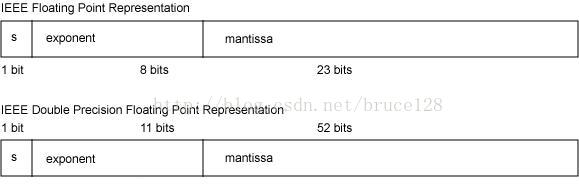

# 浮点数

32位的浮点数(float单精度)：1bit的符号位，8bit的exponent指数,23bit的mantissa尾数.

64位的浮点数(double双精度)：1bit的符号位，11bit的exponent指数,52bit的mantissa尾数.

## 精度丢失
- 进制转化

## bigDecimal
1.如果你希望BigDecimal能够精确地表示你希望的数值，那么一定要使用字符串来表示小数，并传递给BigDecimal的构造函数。
2.如果你使用Double.toString来把double转化字符串，然后调用BigDecimal(String)，这个也是不靠谱的，它不一定按你的想法工作。
3.如果你不是很在乎是否完全精确地表示，并且使用了BigDecimal(double)，那么要注意double本身的特例，double的规范本身定义了几个特殊的double值(Infinite，-Infinite，NaN)，不要把这些值传给BigDecimal，否则会抛出异常。